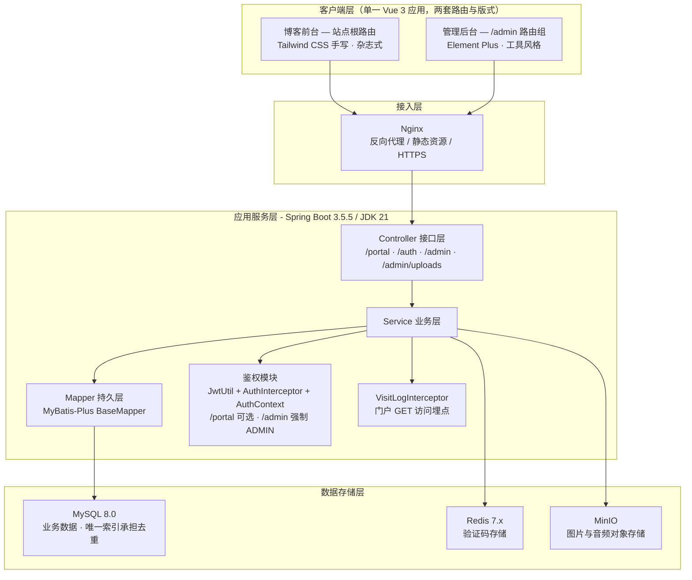
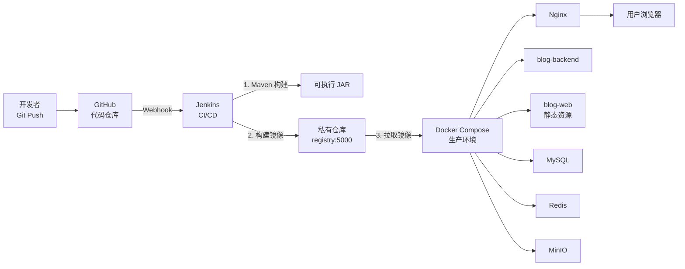

# 简柚个人博客系统的设计与实现 — 选题方案与技术方案

> 学生：简之航　学号：202420330504　班级：软件技术 2-2405
> 专业：软件技术（人工智能学院）　选题类型：A、产品设计
> 版本：v1.2　日期：2026-09-23
>
> **v1.2 修订要点**：以**已实现代码与线上数据库真实结构**为基准全面校准——技术栈按实际依赖收敛（未引入的组件单独说明取舍）、前后台合并为单一前端工程、功能清单区分「已实现 / 未落地」并新增 5.6 与任务书逐项比对、点赞改为按账号落库（与数据库设计文档 `like_record` 一致）、目录结构与接口错误码对齐实现。

---

## 一、选题概况

| 项目 | 内容 |
|---|---|
| 毕业设计题目 | 简柚个人博客系统的设计与实现 |
| 选题类型 | A、产品设计 |
| 系统名称 | 简柚博客（JianYou Blog） |
| 系统形态 | B/S 架构，前后端分离，含博客前台 + 管理后台 + 服务端 |
| 开发模式 | MVC 分层，RESTful API 通信 |

### 1.1 选题背景

随着互联网内容生态的持续发展，个人博客作为知识沉淀与个人品牌建设的重要载体，重新受到技术从业者与内容创作者的重视。相较于依赖第三方平台（如 CSDN、知乎专栏）的写作方式，自建博客具有内容完全自主、数据永久可控、可深度定制界面与交互等显著优势。

当前主流的个人博客方案主要分为两类：一类是基于 Hexo、Hugo 等静态站点生成器的方案，其优点是部署简单，但缺点是缺乏后端数据支撑，无法实现用户体系、互动记录、访问统计等动态功能；另一类是基于 WordPress 等成熟 CMS 的方案，功能完善但系统臃肿、二次开发成本高，且界面上难以实现现代简约的视觉风格。

本课题基于 Spring Boot 3 与 Vue 3 构建一套前后端分离的个人博客系统，在实现文章管理、用户体系、互动记录等完整功能的同时，重点打磨前端的视觉表现与交互体验，为博客类应用提供一套"功能完整、界面精致、易于维护"的参考实现方案。

### 1.2 选题意义

**技术实践意义**
本课题完整覆盖了现代 Java Web 开发的核心技术链路：Spring Boot 3 框架应用、MyBatis-Plus 持久层开发、MySQL 数据库设计与优化、Redis 键值存储应用、BCrypt 密码加密 + JWT 令牌鉴权、Vue 3 组合式 API 前端开发、Docker 容器化部署与 Jenkins 持续集成。通过本课题可将软件技术专业所学知识串联为完整工程实践。

**工程能力意义**
本课题不止于功能实现，还包含需求分析、概要设计、数据库设计、接口设计、系统测试、部署运维的完整软件工程流程，能够系统锻炼项目规划能力与复杂问题解决能力。

**实际应用意义**
系统开发完成后可直接作为个人技术博客投入使用，具备真实的实用价值，且代码结构规范、文档完整，可作为后续功能迭代的基础。

---

## 二、系统架构设计

### 2.1 总体架构

系统采用前后端分离的 B/S 架构，分为四层：客户端层、接入层、应用服务层、数据存储层。



### 2.2 分层职责

| 层次 | 职责 | 关键技术 |
|---|---|---|
| 客户端层 | 界面渲染、交互响应、路由跳转 | Vue 3、Vite、Pinia、Axios、Tailwind CSS、Element Plus |
| 接入层 | 反向代理、静态资源、SSL 终止 | Nginx |
| 接口层 | 参数校验、请求路由、统一响应 | Spring MVC、Jakarta Validation |
| 业务层 | 业务逻辑编排、事务控制、缓存读写 | Spring、MyBatis-Plus |
| 持久层 | SQL 执行、结果映射、分页 | MyBatis-Plus、HikariCP |
| 数据层 | 数据持久化、缓存、文件存储 | MySQL、Redis、MinIO |

### 2.3 部署架构

采用 Docker Compose 编排全部服务，Jenkins 实现自动化构建与发布。



---

## 三、技术栈选型

### 3.1 后端技术栈

| 技术 | 版本 | 用途 | 选型理由 |
|---|---|---|---|
| JDK | 21 (LTS) | 运行环境 | 长期支持版，支持虚拟线程、Record 等新特性 |
| Spring Boot | 3.5.x | 应用框架 | 生态成熟，自动配置，社区资料丰富 |
| Spring MVC + 拦截器 | 6.x | 接口层与鉴权 | 用 `AuthInterceptor` + `AuthContext` 完成认证授权，比完整 Spring Security 过滤链更贴合单机毕设体量 |
| Spring Security Crypto | 6.x | 密码散列 | **仅引入 `spring-security-crypto`** 使用 BCrypt，不引入过滤链 |
| MyBatis-Plus | 3.5.7 | 持久层框架 | 单表 CRUD 零 SQL，`LambdaQueryWrapper` 构造条件，分页插件开箱即用 |
| MySQL | 8.0 | 关系型数据库 | 事务与行锁保证计数准确；唯一索引承担点赞 / 收藏去重 |
| Redis | 7.x | 键值数据库 | 存储找回密码的手机号 / 邮箱验证码，用 TTL 实现 5 分钟过期与 60 秒发送冷却 |
| MinIO | 8.5.x | 对象存储 | 兼容 S3 协议，可私有部署，替代云 OSS |
| ip2region | 3.3.7 | IP 归属地离线解析 | 数据文件（10.6MB）随包内置、启动时载入内存做二分查找，微秒级、**零外部请求**，不依赖第三方接口的可用性 |
| JJWT | 0.12.x | JWT 工具库 | API 简洁，签名算法可配，与 Spring Boot 3 兼容 |
| HikariCP | 随 Boot 内置 | 数据库连接池 | Spring Boot 默认连接池，性能优、零额外依赖 |
| Lombok | 1.18.x | 代码简化 | 减少样板代码，提升可读性 |

> **选型取舍**：开发初期曾考虑 Druid（SQL 监控）、Knife4j（接口文档）、Hutool（工具库）、完整 Spring Security 过滤链等组件，实施阶段为保持工程轻量、减少非必要依赖，最终**均未引入**——接口文档改由 `docs/` 下的 Markdown 契约与本报告维护，工具方法用 JDK 与 Spring 原生 API 实现，鉴权改用 MVC 拦截器。

### 3.2 前端技术栈

| 技术 | 版本 | 用途 | 适用端 |
|---|---|---|---|
| Vue | 3.5 | 前端框架 | 前台 + 后台 |
| Vite | 5.x | 构建工具 | 前台 + 后台 |
| TypeScript | 5.x | 类型系统 | 前台 + 后台 |
| Pinia | 2.x | 状态管理 | 前台 + 后台 |
| Vue Router | 4.x | 路由管理 | 前台 + 后台 |
| Axios | 1.x | HTTP 客户端 | 前台 + 后台 |
| Tailwind CSS | 3.4 | 原子化 CSS | 前台（后台不启用） |
| Element Plus | 2.14 | 组件库 | 后台路由组 |
| markdown-it | 14.x | Markdown 渲染 | 前台正文 + 后台预览 |
| highlight.js | 11.x | 代码高亮 | 前台正文 |
| Day.js | 1.11 | 时间处理 | 前台 + 后台 |

> **前端工程组织**：管理后台**不是独立工程**，而是 `blog-web` 这个单一 Vue 应用内的 `/admin` 路由组——后台页面放在 `src/views/admin/`，共用 `AdminLayout.vue` 布局与 `src/styles/tokens.css` 设计令牌，登录后按角色跳转。这样一份构建产物同时承载前台与后台，避免两套工程重复维护。
>
> **未引入的组件**：Markdown 编辑器用 `<textarea>` + `markdown-it` 实时预览自行拼装（未引 `md-editor-v3`）；数据看板用 Element Plus 统计卡与列表呈现（未引 `ECharts`）。理由是这两个组件对毕设体量而言收益有限，同时能减少 3 个前端依赖与约 1.2 MB 打包体积。

### 3.3 前端 UI 双轨方案说明

本系统前端存在两套界面，其视觉目标与交互诉求完全不同，因此采用**双轨 UI 方案**：

| 对比项 | 博客前台 | 管理后台 |
|---|---|---|
| 面向用户 | 访客、读者 | 博主本人 |
| 视觉目标 | 杂志式："墨色刊头 + 暖纸正文" | 工具风格：信息密度高、操作高效 |
| UI 方案 | Tailwind CSS 手写 | Element Plus 组件库 |
| 设计令牌 | 共享 `tokens.css` | 共享 `tokens.css` |
| 维护策略 | 令牌层统一管理，样式类内联可读 | 使用组件库默认主题，不魔改 |

**设计令牌层（Design Token）** 是保证"视觉统一 + 好维护"的关键：将颜色、圆角、阴影、字体、间距全部抽取为 CSS 变量，集中定义于 `tokens.css`。前台与后台均引用该文件，主题调整仅需修改一处。

**前台视觉实现要点（已定稿，勿回退成通用模板样式）**

| 要素 | 实现方式 |
|---|---|
| 墨色刊头 | 深墨绿 `#101714`（`--ink-*` 变量组）全屏区块 + 反白衬线大字，每个页面开头都是；默认浅色主题，暗色仅手动切换 |
| 暖纸正文 | 底色 `#faf9f7`，主色柚橙 `#d95d18`，辅色墨绿 `#2f5d50` |
| 衬线展示字体 | `--font-display`（Noto Serif SC 栈）用于标题、序号、月份；正文用无衬线 |
| 竖向幽灵刊名 | 首页刊头竖排刊名，随滚动位移做视差反向偏移 |
| 内容中性化 | 不设推荐位 / 精选位 / 营销文案；措辞用"最近写的""按时间翻"等记录式表达 |
| 动画缓动 | `cubic-bezier(0.4, 0, 0.2, 1)`，时长 200-400ms |
| 滚动效果 | IntersectionObserver 实现元素淡入上浮（`.reveal`），异步数据页面渲染后需重新观察 |
| 无边框 | 用背景色差与阴影替代 `border` |

### 3.4 DevOps 技术栈

| 技术 | 用途 |
|---|---|
| Docker | 应用容器化 |
| Docker Compose | 多服务编排 |
| Jenkins | 持续集成 / 持续部署 |
| Nginx | 反向代理、静态资源、HTTPS |
| registry:5000 | 私有镜像仓库 |
| Prometheus + Grafana | 指标监控与可视化 |
| Loki + Promtail | 日志聚合 |
| certbot | Let's Encrypt 证书自动续期 |

---

## 四、目录结构设计

### 4.1 后端目录结构 `blog-backend/`

采用**单模块标准分层**结构，兼顾清晰与简单（多模块拆分对毕设而言过重）。

```
blog-backend/
├── pom.xml
├── Dockerfile
└── src/
    ├── main/
    │   ├── java/com/jianyou/blog/
    │   │   ├── BlogApplication.java            # 启动类
    │   │   ├── common/                         # 通用层
    │   │   │   ├── Result.java                 # 统一响应体
    │   │   │   ├── PageResult.java             # 分页响应体
    │   │   │   ├── BusinessException.java      # 业务异常
    │   │   │   ├── GlobalExceptionHandler.java # 全局异常处理
    │   │   │   └── AuthContext.java            # 请求级登录态（ThreadLocal）
    │   │   ├── config/                         # 配置层
    │   │   │   ├── WebConfig.java              # CORS + 拦截器注册
    │   │   │   ├── MybatisPlusConfig.java      # 分页插件
    │   │   │   ├── MinioConfig.java            # MinIO 客户端
    │   │   │   ├── PasswordConfig.java         # BCrypt 编码器
    │   │   │   ├── SiteProperties.java         # site.* 站点默认配置
    │   │   │   ├── MinioProperties.java        # minio.* 配置
    │   │   │   └── DataLoader.java             # 启动时补写博主账号密码
    │   │   ├── interceptor/                    # 拦截器
    │   │   │   ├── AuthInterceptor.java        # 鉴权（门户可选 / 后台强制 ADMIN）
    │   │   │   └── VisitLogInterceptor.java    # 访问埋点
    │   │   ├── controller/                     # 接口层（扁平结构）
    │   │   │   ├── ArticleController.java      # /portal/articles
    │   │   │   ├── CommentController.java      # /portal/comments
    │   │   │   ├── MessageController.java      # /portal/messages
    │   │   │   ├── AlbumController.java        # /portal/album
    │   │   │   ├── MusicController.java        # /portal/music
    │   │   │   ├── FriendLinkController.java   # /portal/links
    │   │   │   ├── TaxonomyController.java     # /portal/categories、/portal/tags
    │   │   │   ├── SiteController.java         # /portal/site/config
    │   │   │   ├── AuthController.java         # /auth/**
    │   │   │   ├── AdminController.java        # /admin/**
    │   │   │   └── UploadController.java       # /admin/uploads
    │   │   ├── service/                        # 业务层（接口与实现合并，构造器注入）
    │   │   ├── mapper/                         # 持久层（一表一 BaseMapper）
    │   │   ├── entity/                         # 数据库实体（@TableName 映射）
    │   │   ├── dto/                            # 入参对象（Jakarta Validation 注解）
    │   │   ├── vo/                             # 出参对象
    │   │   └── util/                           # 工具类
    │   │       ├── JwtUtil.java                # 签发与解析
    │   │       ├── IpUtils.java                # 客户端 IP 获取与属地脱敏
    │   │       └── ProvinceResolver.java       # IP → 省份
    │   └── resources/
    │       ├── application.yml                 # 主配置（含 site.*、jwt、minio）
    │       └── db/
    │           └── init.sql                    # 建库建表 + 种子数据（唯一脚本，含历史全部变更，可重复执行）
    └── test/java/                              # 单元测试
```

### 4.2 前端目录结构 `blog-web/`（前台 + 后台同工程）

```
blog-web/
├── index.html
├── vite.config.ts                    # 含 /api 代理，目标可用 VITE_PROXY_TARGET 覆盖
├── tailwind.config.js
├── postcss.config.js
├── tsconfig.json
├── Dockerfile
├── nginx.conf
└── src/
    ├── main.ts
    ├── App.vue
    ├── types.ts                      # 全站共享类型（Article / Comment / User …）
    ├── env.d.ts
    ├── api/                          # 接口封装
    │   ├── request.ts                # Axios 实例 + 拦截器（注入 Token、统一错误）
    │   ├── index.ts                  # 前台接口
    │   ├── auth.ts                   # 登录注册、资料、密码、头像
    │   └── admin.ts                  # 后台接口
    ├── assets/
    ├── components/                   # 通用组件
    │   ├── AppHeader.vue             # 导航（8 项纯文字，无图标）
    │   ├── AppFooter.vue
    │   ├── ArticleCard.vue           # 无封面时自动生成渐变题图
    │   ├── BackToTop.vue
    │   ├── PageMasthead.vue          # 墨色刊头（全站统一开篇）
    │   ├── Pagination.vue
    │   ├── Preloader.vue
    │   ├── RouteProgress.vue
    │   └── Skeleton.vue
    ├── composables/                  # 组合式函数
    │   ├── useScrollReveal.ts        # 滚动淡入（.reveal 观察器）
    │   ├── useTheme.ts               # 明暗主题（默认浅色）
    │   └── useBgm.ts                 # 背景音乐播放
    ├── layouts/
    │   ├── DefaultLayout.vue         # 前台布局（头 / 尾 / 回到顶部）
    │   └── AdminLayout.vue           # 后台布局（侧边栏 / 顶栏）
    ├── router/
    │   ├── index.ts                  # 前台路由 + /admin 路由组
    │   └── guard.ts                  # 路由守卫（登录态、后台角色）
    ├── stores/                       # Pinia
    │   ├── user.ts                   # 登录态与 Token 持久化
    │   └── site.ts                   # 站点配置缓存
    ├── styles/
    │   ├── tokens.css                # ⭐ 设计令牌（前台 + 后台共享）
    │   ├── base.css                  # 基础重置
    │   ├── markdown.css              # 正文排版
    │   └── element-theme.css         # 后台组件库主题覆盖
    ├── utils/
    │   ├── format.ts                 # 时间、数字格式化
    │   └── markdown.ts               # markdown-it + highlight.js 渲染
    └── views/
        ├── home/                     # 首页三组件
        │   ├── HomeView.vue
        │   ├── MagazineHero.vue      # 墨色刊头 + 竖排幽灵刊名视差
        │   ├── FeaturedEditorial.vue # 横滑「最近落笔」卡片带
        │   └── TimelineList.vue      # 按时间时间线
        ├── article/ArticleListView.vue
        ├── article/ArticleDetailView.vue
        ├── category/CategoryView.vue # 兜底分类列表
        ├── category/TravelView.vue   # 游记（封面卡片流）
        ├── category/EssayView.vue    # 随笔（杂志目录）
        ├── category/RecordView.vue   # 记录（时间轴）
        ├── album/AlbumView.vue       # 相册（瀑布流 + 大图弹层）
        ├── toolbox/ToolboxView.vue   # 百宝箱（工具卡 + 友链）
        ├── archive/ArchiveView.vue   # 归档
        ├── tag/TagView.vue
        ├── search/SearchView.vue     # 检索（沉浸首屏 + 目录式结果）
        ├── about/AboutView.vue       # 家
        ├── message/MessageView.vue   # 留言板（文字雨）
        ├── user/LoginView.vue
        ├── user/RegisterView.vue
        ├── user/ProfileView.vue
        ├── user/ProfileInfoView.vue  # 资料 / 头像 / 改密
        ├── user/MyCollectionsView.vue# 我的收藏
        ├── error/NotFoundView.vue
        └── admin/                    # 后台页面（/admin 路由组）
            ├── DashboardView.vue         # 数据看板
            ├── ArticleManageView.vue     # 文章列表
            ├── ArticleEditView.vue       # 文章编辑（Markdown 编辑 + 预览）
            ├── CategoryManageView.vue
            ├── TagManageView.vue
            ├── MessageManageView.vue
            ├── LinkManageView.vue
            ├── UserManageView.vue
            ├── AlbumManageView.vue
            ├── MusicManageView.vue
            ├── ResourceManageView.vue
            └── SettingView.vue           # 站点设置
```

### 4.3 部署与脚本目录

```
bi_ye_she_ji/
├── docker-compose.yml            # 本地编排（MySQL 3307 / Redis 6380 / MinIO）
├── scripts/                      # 联调与验收脚本（Node，无第三方依赖）
│   ├── smoke-auth.mjs            # 接口冒烟断言
│   └── verify-*.mjs              # 真实浏览器端到端验证
├── shots/                        # 截图与验证结果落盘目录
└── docs/                         # 全部设计文档
```

> **规划中的部署目录**：`deploy/` 下的 Nginx 站点配置、Jenkinsfile、Prometheus / Grafana / Loki 配置、certbot 证书目录属于**部署阶段的规划内容**，当前阶段尚未落盘——本文档只描述目标形态，实际文件在部署阶段生成，避免文档中列出空目录。

---

## 五、功能模块清单

系统共实现 **30 个前台功能点 + 22 个后台功能点**，分为博客前台、管理后台两大类。毕业设计任务书与设计阶段列出但本期未落地的 **12 项**功能，集中列在 5.6「与任务书的差异说明」中，并给出取舍理由。

> **标注约定**：本清单以**已实现代码**为准。凡设计阶段提出但本期未实现的功能，一律移入 5.6 并注明原因，不在主清单中混列——保证文档与代码、答辩演示三者一致。

### 5.1 功能结构总览

```mermaid
graph TB
    ROOT["简柚个人博客系统"]

    ROOT --> P["博客前台"]
    ROOT --> A["管理后台"]

    P --> P1["用户中心"]
    P --> P2["内容浏览"]
    P --> P3["互动交流"]
    P --> P4["个人角落"]

    P1 --> P11["手机号注册"]
    P1 --> P12["邮箱注册"]
    P1 --> P13["登录 / 退出"]
    P1 --> P14["个人中心（资料 / 头像 / 改密）"]
    P1 --> P15["我的收藏"]

    P2 --> P21["首页（墨色刊头 + 时间线）"]
    P2 --> P22["文章详情"]
    P2 --> P23["分类浏览（记录 / 游记 / 随笔）"]
    P2 --> P24["标签浏览"]
    P2 --> P25["归档时间线"]
    P2 --> P26["关键词检索（标题 + 摘要）"]

    P3 --> P31["文章点赞（需登录）"]
    P3 --> P32["文章收藏（需登录）"]
    P3 --> P33["留言板（文字雨）"]
    P3 --> P34["友链申请"]

    P4 --> P41["相册（瀑布流）"]
    P4 --> P42["百宝箱（工具 + 友链）"]
    P4 --> P43["背景音乐"]
    P4 --> P44["明暗主题切换"]

    A --> A1["内容管理"]
    A --> A2["互动管理"]
    A --> A3["系统与资源"]

    A1 --> A11["文章增删改查"]
    A1 --> A12["草稿 / 发布 / 下线"]
    A1 --> A13["置顶标记"]
    A1 --> A14["分类管理"]
    A1 --> A15["标签管理"]

    A2 --> A21["留言管理"]
    A2 --> A22["友链审核"]
    A2 --> A23["用户管理"]

    A3 --> A31["数据看板"]
    A3 --> A32["站点设置"]
    A3 --> A33["相册管理"]
    A3 --> A34["音乐管理"]
    A3 --> A35["上传资源管理"]
```



### 5.2 用户体系与权限

**登录标识**：全站**不设用户名字段**。唯一登录标识为手机号或邮箱，`t_user` 上各建唯一索引（`uk_phone` / `uk_email`），注册时至少填写一个，登录时按 `phone = account OR email = account` 匹配。

| 角色 | 识别方式 | 权限范围 |
|---|---|---|
| 游客 | 无 Token | 浏览文章列表 / 详情、分类、标签、归档、检索、相册、百宝箱、留言墙；**发表留言**（提交后仅在本页文字雨中飘落一次，不入库）、**申请友链**；查看留言 |
| 注册用户 | `role = USER` | 游客全部权限 + 按账号**点赞 / 取消点赞**、按账号**收藏 / 取消收藏**、**留言落库**（在留言墙留痕）、查看「我的收藏」、修改资料 / 头像 / 密码 |
| 管理员 | `role = ADMIN` | 注册用户全部权限 + 全部后台管理接口（`/admin/**`） |

**权限判定实现**：`AuthInterceptor` 对 `/portal/**` 采用**可选鉴权**——带 Token 则解析出 `userId` 与 `role` 写入 `AuthContext`（ThreadLocal），不带也放行；对 `/admin/**` 强制要求 `role = ADMIN`，否则 403。真正依赖身份的动作（点赞、收藏）在 Service 层取 `AuthContext.getUserId()`，为 `null` 则抛 401，由前端引导跳登录页。

> **为什么点赞 / 收藏必须登录**：点赞与收藏必须先回答"是谁点的"才能去重与回显（见 `t_like_record`、`t_collect` 的唯一索引），因此必须绑定账号；留言则允许游客试发（仅本页可见、不入库），保持「路过说一句」的低门槛。浏览量同样依赖唯一索引去重（`t_view_record.uk_article_visitor`），但它允许以游客 IP 作为访客标识兜底，因此**不强制登录**——两者都靠唯一索引保证"同一人不重复计数"，差别只在于未登录时还能不能取到身份。
>
> **留言墙的特殊处理**：游客在留言墙可直接提交，但**不入库**——只在前端本页文字雨中飘一次（`MessageView` 判断未登录即走本地分支），刷新即散；登录用户提交则调 `POST /portal/messages` 落库留痕。这样既保留了"路过说一句"的低门槛，又避免匿名数据污染后台留言管理。

**注册登录方案（与当前实现一致）**

| 环节 | 字段与校验 |
|---|---|
| 注册 | 手机号、邮箱（**两者至少填一个**，格式分别校验 `^1[3-9]\d{9}$` 与邮箱正则，前端实时校验、服务端 `@Pattern` 复核，全站唯一） + 昵称（2–20 字） + 密码（6–32 位） |
| 登录 | 单一输入框 `account`，后端按 `phone` OR `email` 匹配，BCrypt 校验密码 |
| 登录态 | 登录 / 注册成功即签发**双 Token**：access（`subject = userId`，附 `role` 声明，默认 **2 小时**，由 `jwt.access-hours` 配置）+ refresh（附 `jti`、不带角色，默认 **7 天**，由 `jwt.refresh-days` 配置）。refresh 的 `jti` 登记 Redis `blog:auth:refresh:{jti}`（TTL 7 天），删除即撤销。前端存 `localStorage`（`token` / `refresh_token`），请求头只携带 access |
| 续期 | access 过期时前端拦截业务码 401，静默调 `POST /api/auth/refresh` 换发新一对并**重放原请求**（用户无感知）。**轮换制**：旧 refresh 用一次即作废；刷新时**回库读取最新 `role` / `status`**，管理员被降权或账号被禁用立即生效 |
| 退出 | 调 `POST /api/auth/logout` 撤销服务端 refresh 登记（幂等），再清本地 Token；**不做 access 黑名单**——access 到期前仍有效，靠 2 小时短效期收敛风险，与「Redis 只承担天然带有效期的数据」原则一致 |
| 管理员登录 | 与普通用户同一登录接口，登录后按 `role` 决定是否可进入 `/admin` 路由组 |
| 博主账号 | 由 `DataLoader` 在启动时以手机号 `13800000001` / 邮箱 `jianyou@local.dev` 为锚点补齐密码，不硬编码在代码中 |

> **验证码注册登录属于后续优化项**：短信 / 邮箱验证码（`@RateLimit` 限流 + Redis 存验证码 + 第三方短信与 SMTP 发送）在需求阶段提出，本期未实现——注册只做格式与唯一性校验。这一取舍避免引入付费短信服务，也让注册链路能在无外网环境下完整演示。

### 5.3 博客前台功能清单

| 编号 | 模块 | 功能点 | 优先级 |
|---|---|---|---|
| F01 | 用户注册 | 手机号注册（格式校验 + 全站唯一） | 高 |
| F02 | 用户注册 | 邮箱注册（格式校验 + 全站唯一） | 高 |
| F03 | 用户登录 | 账号密码登录（自动识别手机号 / 邮箱） | 高 |
| F04 | 用户退出 | 退出登录（撤销服务端 refresh 登记 + 清除本地 Token） | 高 |
| F05 | 个人中心 | 修改昵称、个人简介 | 高 |
| F06 | 个人中心 | 修改头像（上传 MinIO） | 高 |
| F07 | 个人中心 | 修改密码（校验原密码） | 高 |
| F08 | 个人中心 | 我的收藏 | 中 |
| F10 | 内容浏览 | 首页（墨色刊头 + 横向卡片带 + 时间线） | 高 |
| F11 | 内容浏览 | 文章列表分页（置顶优先，再按发布时间倒序） | 高 |
| F12 | 内容浏览 | 按分类浏览（记录 / 游记 / 随笔三套独立版式） | 高 |
| F13 | 内容浏览 | 按标签浏览 | 高 |
| F14 | 内容浏览 | 关键词检索（标题 + 摘要） | 高 |
| F15 | 内容浏览 | 文章详情（Markdown 渲染 + 代码高亮） | 高 |
| F16 | 内容浏览 | 归档页（按年月时间线） | 高 |
| F18 | 内容浏览 | 浏览量累加 | 高 |
| F19 | 内容浏览 | 关于（「家」）页面 | 高 |
| F20 | 互动交流 | 文章点赞 / 取消（登录后按账号去重，刷新保持） | 高 |
| F21 | 互动交流 | 文章收藏 / 取消 + 「已收藏」回显 | 高 |
| F22 | 互动交流 | 留言墙（文字雨；游客可试发但仅本页可见，登录后落库） | 高 |
| F23 | 互动交流 | 友链申请 | 中 |
| F24 | 个人角落 | 相册（瀑布流 + 大图弹层） | 中 |
| F25 | 个人角落 | 百宝箱（工具导航 + 友链展示） | 中 |
| F26 | 个人角落 | 背景音乐播放 | 低 |
| F27 | 个人角落 | 明暗主题切换（默认浅色） | 中 |

### 5.4 管理后台功能清单

| 编号 | 模块 | 功能点 | 优先级 |
|---|---|---|---|
| B01 | 登录 | 管理员登录（同一登录接口，按 `role` 进入 `/admin`） | 高 |
| B02 | 数据看板 | 文章 / 留言 / 用户 / 待审友链 统计卡 | 高 |
| B03 | 数据看板 | 全站累计浏览量 | 高 |
| B04 | 数据看板 | 今日访问总量 + 按省份分布 | 中 |
| B05 | 数据看板 | 最新文章列表 | 中 |
| B06 | 文章管理 | 文章列表（分页、按状态筛选） | 高 |
| B07 | 文章管理 | 新增 / 编辑文章（Markdown 编辑 + 实时预览） | 高 |
| B08 | 文章管理 | 删除文章（服务层级联清理其点赞 / 收藏） | 高 |
| B09 | 文章管理 | 草稿 / 发布 / 下线（状态切换） | 高 |
| B10 | 文章管理 | 置顶标记 | 中 |
| B11 | 分类管理 | 分类增删改查 | 高 |
| B12 | 标签管理 | 标签增删改查 | 高 |
| B13 | 留言管理 | 留言列表（按 IP 属地筛选）+ 删除 | 高 |
| B14 | 友链管理 | 友链审核（通过 / 拒绝）+ 增删改 | 中 |
| B15 | 用户管理 | 用户列表（按手机号 / 邮箱 / 昵称检索）、禁用 / 启用 | 高 |
| B16 | 相册管理 | 照片新增 / 编辑 / 上架下架 / 删除 | 中 |
| B17 | 音乐管理 | 背景音乐新增 / 编辑 / 启停 / 删除 | 中 |
| B18 | 资源管理 | 上传文件列表（MinIO）与删除 | 高 |
| B19 | 站点设置 | 博客名、Logo、备案号、社交链接 | 高 |
| B20 | 文件上传 | 图片 / 音频上传（MinIO，含类型与大小校验） | 高 |
| B21 | 接口鉴权 | `/admin/**` 统一强制 `role = ADMIN`，否则 403 | 高 |

### 5.5 技术亮点模块（答辩加分项）

| 亮点 | 技术实现 | 可讲述的知识点 |
|---|---|---|
| 按账号点赞去重 | `t_like_record` 唯一索引 `uk_user_article(user_id, target_id)` + 捕获 `DuplicateKeyException` 兜底并发 | 用数据库唯一约束承担并发去重，优于应用层「先查后插」 |
| 点赞状态回显 | 详情 / 列表接口按当前 `userId` **批量**查询已点赞集合，VO 带 `liked` 字段 | 一次批量查询消除 N+1 |
| 收藏状态回显 | 详情 / 列表接口按当前 `userId` **批量**查询已收藏集合，VO 带 `collected` 字段，前台卡片显示已收藏徽标 | 与点赞回显同构，一次批量查询消除 N+1 |
| 浏览量按访客去重 | `t_view_record` 唯一索引 `uk_article_visitor(article_id, visitor_key)` + `INSERT IGNORE`，写入成功才让 `view_count = view_count + 1` 原子自增 | 唯一索引承担「同一访客只计一次」，与点赞 / 收藏同一套去重语言；`setSql` 原子更新避免读改写竞态 |
| 访问埋点 | `VisitLogInterceptor` 拦截门户 GET 请求（IP / 路径 / UA），交线程池异步落库，看板按日聚合 | 拦截器机制、异步削峰 |
| 无状态认证 | JWT（`subject = userId` + `role` 声明）+ 拦截器可选鉴权 + `AuthContext` ThreadLocal | 无状态认证、ThreadLocal 生命周期与 `afterCompletion` 清理 |
| 用户数据隔离 | 收藏 / 点赞全部取自 `AuthContext.getUserId()`，配合联合唯一索引 | 水平越权防护、接口按身份收敛 |
| 统一响应与异常 | `Result<T>` 泛型封装 + `@RestControllerAdvice` 全局异常处理 + 业务错误码 | 泛型、异常体系分层、错误码规范 |
| 关键词检索 | `title` / `summary` 的 `LIKE` 匹配，用 `wrapper.and(w -> ...)` 分组避免条件泄漏 | 条件构造器的括号分组、索引失效与优化方向 |
| 数据库设计 | 14 张表的范式化设计 + 有意冗余计数列 + 唯一索引承担业务约束 | 反范式权衡、索引设计 |
| 设计令牌 | `tokens.css` 抽取颜色 / 圆角 / 阴影 / 字体变量，前台与后台共享一份 | 设计系统与可维护性 |

### 5.6 与任务书的差异说明（未落地项）

毕业设计任务书与概要设计阶段列出的功能中，下列 **12 项**在本期未落地。表中同时给出方案要点与取舍理由，便于在正文与答辩中主动说明——**不隐藏差异，也不虚构已实现**。同一份清单见 `docs/02-设计文档/需求分析.md` 第 9.2 节。

| 任务书 / 设计条目 | 方案要点 | 本期状态与原因 |
|---|---|---|
| ngram 全文搜索 | `ALTER TABLE t_article ADD FULLTEXT KEY ft_title_content (title, summary, content) WITH PARSER ngram`，改用 `MATCH … AGAINST` 按相关度排序 | **未实现**。当前数据量下 `title` / `summary` 的 `LIKE` 匹配已满足检索需求；DDL 保留在数据库设计文档 3.4 节作为优化项 |
| 浏览量 Redis 缓冲 + 定时落库 | Redis Hash 累加，Spring Task 定时批量写回 `t_article.view_count`；热门榜改用 Redis ZSet 记分 | **未实现**。改为按独立访客去重（`t_view_record` 唯一索引 `uk_article_visitor` + `INSERT IGNORE`，写入成功才计数）后直接 `view_count = view_count + 1` 原子自增——单机场景更简单且不丢数；热门排行功能在设计后期整体移除（前端未接入、后端接口与缓存代码一并删除），Redis ZSet 榜不在本期范围 |
| 敏感词过滤 | 词库加载进内存构建 Trie 字典树，留言提交时匹配，命中按等级替换或拒绝 | **未实现**。预留表 `t_sensitive_word` 已完成结构设计但未建表；留言量级小、后台可人工删除，暂不引入 |
| 文章版本历史与回滚 | 全量快照表 `t_article_history`，版本号应用层递增，支持版本列表与一键回滚 | **未实现**。单作者低频写作场景收益低，且工程层 Git 已承担版本管理职责 |
| 后台操作日志 | `t_operation_log` 表 + AOP 切面记录操作人、模块、动作、URI、IP、耗时、结果 | **未实现**。后台为单管理员使用，审计需求弱；访问侧统计已由 `t_visit_log` 埋点覆盖 |
| 短信 / 邮箱验证码 | `@RateLimit` 限流 + Redis 存验证码（5 分钟 TTL）+ 第三方短信 / SMTP 发送 | **部分实现**。找回密码已用上验证码：Redis 存码（5 分钟 TTL）+ 60 秒冷却 + 错 5 次作废，通道层做成可替换接口，当前为占位实现（仅打日志、不回传生产环境）。注册仍为手机号 / 邮箱格式校验 + 全站唯一校验，未接真实短信 / SMTP 通道 |
| 文章定时发布 | 增加"定时"状态 + Spring Task 每分钟扫描 `publish_time <= NOW()` 自动发布 | **未实现**。文章状态已支持草稿 / 发布 / 下线三态手动切换 |
| 接口限流 | `@RateLimit` 自定义注解 + AOP + Redis 滑动窗口，覆盖登录 / 注册 / 发留言 / 搜索入口 | **未实现**。因此错误码表中不含 `429` |
| 相册分组 | 增加相册分组表，照片附 `album_id`，前台增加分组筛选条 | **未实现**。相册为单表 `t_photo` 承载，按上传时间倒序展示 |
| 用户重置密码 | 管理员将用户密码置为一次性临时密码 | **用户端已实现，管理员端未实现**。用户可在登录页点「忘记密码」自助找回：输入手机号 / 邮箱 → 校验验证码 → 设新密码，找回方式跟随注册时留下的联系方式（只有手机号就走手机号，两者都有则自选）。管理员代重置（发一次性临时密码、首次登录强制修改）仍未实现 |
| 数据看板图表 | ECharts 绘制近 30 天访问趋势折线图与分类占比饼图 | **未实现**。看板已提供文章 / 留言 / 用户 / 待审友链统计卡、累计浏览量、今日访问总量与省份分布、最近留言列表，未引入图表库 |
| 博主回复留言 | `t_message` 增加 `reply` / `reply_time` 列 + `PUT /admin/messages/{id}/reply` 接口 + 前台留言字幅回显回复 | **本期主动移除**。留言板定位为「一次性留言」，读者留一句、博主看过即可；回复链路会把留言页从「留言」变成「对话区」，与站点记录式基调不符。已删除两列与回复接口，后台留言管理保留按 IP 属地筛选与删除 |

> **取舍总原则**：优先保证「内容发布 → 浏览 → 互动（点赞 / 收藏 / 留言）→ 后台管理」主链路端到端可演示、数据真实落库；风控类（验证码、敏感词、限流）、统计增强类（图表、ZSet 榜）、编辑增强类（定时发布、版本回滚、相册分组）功能在大三毕设周期内列为预留项，并在正文「系统设计」章节说明设计思路与后续优化路径。
>
> **2026-10-07 移出清单**：「双 Token 与退出黑名单」原列于此（**13 项**），现已实现——access 2h + refresh 7d、
> 轮换制续期、Redis 撤销登记（`blog:auth:refresh:{jti}`）、`POST /auth/refresh` 与 `POST /auth/logout` 上线，
> 请求凭证只认 access。故清单降为 **12 项**。其中 access token 黑名单未做（靠 2 小时短效期收敛风险），
> 作为取舍保留在 5.2 节说明，不再单列为待实现项。

---

## 六、数据库设计概要

数据库名 `jianyou_blog`，字符集 `utf8mb4`，排序规则 `utf8mb4_unicode_ci`。

共 **15 张表**（下表为逻辑名 ↔ 物理表名对照，物理表统一带 `t_` 前缀）：

| 序号 | 逻辑名 | 物理表名 | 中文名 | 说明 |
|---|---|---|---|---|
| 1 | user | `t_user` | 用户表 | 手机号 / 邮箱双唯一索引，**无用户名字段** |
| 2 | category | `t_category` | 分类表 | 记录 / 游记 / 随笔 |
| 3 | tag | `t_tag` | 标签表 | |
| 4 | article | `t_article` | 文章表 | 含状态、置顶、浏览量 / 点赞 / 收藏计数冗余列 |
| 5 | article_tag | `t_article_tag` | 文章标签关联表 | 多对多，联合主键 |
| 6 | like_record | `t_like_record` | 点赞记录表 | `uk_user_article(user_id, target_id)` 防重复点赞并支撑「我是否点过赞」回显 |
| 7 | collect | `t_collect` | 收藏表 | `uk_user_article(user_id, article_id)` |
| 8 | view_record | `t_view_record` | 文章浏览记录表 | `uk_article_visitor(article_id, visitor_key)` 承担浏览量去重：同一访客对同一篇文章终身只计一次 |
| 9 | message | `t_message` | 留言表 | 单层留言，无回复字段 |
| 10 | friend_link | `t_friend_link` | 友链表 | 含审核状态 |
| 11 | file | `t_file` | 上传资源表 | MinIO 上传记录 |
| 12 | visit_log | `t_visit_log` | 访问日志埋点表 | 数据看板的今日访问与省份分布 |
| 13 | site_config | `t_site_config` | 站点配置表 | Key-Value 结构 |
| 14 | photo | `t_photo` | 相册照片表 | 单表承载相册 |
| 15 | music | `t_music` | 背景音乐表 | |

逐表字段、索引与设计说明见 `docs/02-设计文档/数据库设计文档.md`；建表与种子数据见 `docs/02-设计文档/init.sql`（与代码版 `blog-backend/src/main/resources/db/init.sql` 保持一致）。

---

## 七、接口设计规范

### 7.1 统一响应格式

```json
{
  "code": 200,
  "message": "success",
  "data": { },
  "timestamp": 1758182400000
}
```

| code | 含义 | 产生位置 |
|---|---|---|
| 200 | 成功 | `Result.ok()` |
| 400 | 业务校验失败（参数非法、重复点赞/收藏等） | `BusinessException(400, ...)` |
| 401 | 未登录或 Token 失效 | 拦截器与 Service 层 `AuthContext` 判空 |
| 403 | 无权限（非 ADMIN 访问后台接口） | `AuthInterceptor` 拦截 `/admin/**` |
| 404 | 资源不存在 | `BusinessException(404, ...)` |
| 415 | 上传文件类型不允许 / 超出大小限制 | `StorageService` |
| 500 | 服务器内部错误 | `GlobalExceptionHandler` 兜底 |

> 说明：文档早期版本列出的 `429 请求过于频繁` 依赖限流切面（见 5.6「接口限流」），本期未实现，故未列入正式错误码。业务异常一律使用**双参构造** `BusinessException(int code, String message)` 显式指定错误码；单参构造会落到默认 500，属易错点。

### 7.2 接口分组

后端统一 `context-path: /api`，因此下列前缀均以 `/api` 开头。

| 前缀 | 说明 | 鉴权 |
|---|---|---|
| `/api/portal/**` | 门户接口（文章、留言、相册、音乐、友链、站点配置） | 可选鉴权：带 Token 则解析身份，未登录也可读；点赞 / 收藏等接口在 Service 层强制要求登录 |
| `/api/auth/**` | 登录、注册、当前用户、资料 / 密码 / 头像 | 登录注册放行；`/me`、资料、密码、头像需登录 |
| `/api/admin/**` | 管理后台接口（含上传 `/admin/uploads`） | 强制 `role = ADMIN`，否则 403 |

### 7.3 RESTful 命名约定

| 操作 | 方法 | 路径示例 |
|---|---|---|
| 查询列表 | GET | `/api/portal/articles?page=1&size=10&categoryId=2` |
| 查询详情 | GET | `/api/portal/articles/{id}` |
| 新增 | POST | `/api/admin/articles` |
| 修改 | PUT | `/api/admin/articles/{id}` |
| 删除 | DELETE | `/api/admin/articles/{id}` |
| 状态变更 | PUT | `/api/admin/articles/{id}/status?status=1` |
| 开关型变更 | PUT | `/api/admin/articles/{id}/top` |
| 点赞 / 取消 | POST / DELETE | `/api/portal/articles/{id}/like` |

---

## 八、开发计划

| 阶段 | 内容 | 交付物 |
|---|---|---|
| 一 | 需求分析与方案设计 | 选题方案、任务书、需求规格 |
| 二 | 系统设计与数据库设计 | 架构图、ER 图、功能结构图、流程图、建表 SQL |
| 三 | 后端开发 | Spring Boot 全部接口 + 冒烟验收脚本 |
| 四 | 前台开发 | 博客前台全部页面（墨色刊头 + 暖纸正文） |
| 五 | 后台开发 | 管理后台全部页面（`/admin` 路由组） |
| 六 | 部署与运维 | Docker 编排、Jenkins 流水线、Nginx、HTTPS、监控 |
| 七 | 文档撰写与答辩准备 | 1.5 万字正文、答辩 PPT |

---

## 九、风险与应对

| 风险 | 影响 | 应对措施 |
|---|---|---|
| 功能范围过大导致延期 | 高 | 优先级分级，先保证高优先级功能全部完成；风控类功能（验证码、敏感词、限流）列入 5.6 未落地项 |
| 前台视觉方案反复（曾两次推翻） | 中 | 先用 `tokens.css` 设计令牌固化「墨色刊头 + 暖纸正文」，再逐页面套用同一节奏；做参考站必须先真实渲染确认再动手 |
| 短信 / 邮件服务需付费 | 中 | 注册改为格式 + 唯一性校验，验证码方案作为预留项写入文档，不虚构发送记录 |
| 文档与代码不一致 | 中 | 数据库设计文档以线上真实表结构（`mysqldump`）为唯一基准重写；功能清单中未实现项统一移入 5.6「与任务书的差异说明」 |
| 部署环境资源受限 | 中 | Docker 单机编排，监控降级为 Prometheus 单实例 |
| 正文查重率过高 | 中 | 正文以自身实现过程与代码为主，减少通用理论堆砌 |

---

*文档结束*
