# 简柚个人博客系统 — 系统功能结构图与业务流程图

> 说明：本文档所有流程均按**当前系统实际实现**绘制（阅读代码与接口实测核对）。
> 设计阶段已定义、本期未实现的能力（敏感词过滤、操作日志、文章版本历史、定时发布、浏览量 Redis 缓冲等）
> 统一在 2.11 节以"预留流程"单列，正文流程中不再混入。

---

## 一、系统功能模块图

### 1.1 总体功能结构

```mermaid
graph TB
    ROOT["简柚个人博客系统<br/>JianYou Blog"]

    ROOT --> PORTAL["博客前台"]
    ROOT --> ADMIN["管理后台"]

    PORTAL --> P1["用户模块"]
    PORTAL --> P2["内容模块"]
    PORTAL --> P3["互动模块"]

    P1 --> P11["手机号注册"]
    P1 --> P12["邮箱注册"]
    P1 --> P13["账号登录（手机号/邮箱）"]
    P1 --> P14["退出登录"]
    P1 --> P15["个人中心<br/>头像 / 昵称简介 / 密码"]
    P1 --> P16["我的收藏"]

    P2 --> P21["首页"]
    P2 --> P22["文章详情"]
    P2 --> P23["分类浏览<br/>游记 / 随笔 / 记录"]
    P2 --> P24["标签浏览"]
    P2 --> P25["归档时间线"]
    P2 --> P26["关键词搜索"]
    P2 --> P28["家（关于我）"]
    P2 --> P29["相册 / 百宝箱"]

    P3 --> P31["文章点赞（需登录）"]
    P3 --> P32["文章收藏（需登录）"]
    P3 --> P33["留言板文字雨"]
    P3 --> P34["友链申请"]

    ADMIN --> A1["内容管理"]
    ADMIN --> A2["互动管理"]
    ADMIN --> A3["用户管理"]
    ADMIN --> A4["系统管理"]

    A1 --> A11["文章管理"]
    A1 --> A12["分类管理"]
    A1 --> A13["标签管理"]
    A1 --> A14["相册管理"]
    A1 --> A15["音乐管理"]

    A2 --> A21["留言管理"]
    A2 --> A22["友链审核"]

    A3 --> A31["用户列表"]
    A3 --> A32["启用 / 禁用"]

    A4 --> A41["数据看板"]
    A4 --> A42["站点设置"]
    A4 --> A43["资源管理（MinIO）"]

    A11 --> A111["文章列表"]
    A11 --> A112["新增 / 编辑"]
    A11 --> A113["草稿 / 发布 / 隐藏"]
    A11 --> A114["置顶"]
    A11 --> A115["删除（级联清理）"]
```

> 说明：`用户重置密码`、`定时发布`、`文章版本历史`、`敏感词管理`、`操作日志` 五个功能点在任务书/概要设计中有要求，本期未实现，故不上图；对应后续方案见 `需求分析.md` 9.2。

### 1.2 后端技术分层结构图

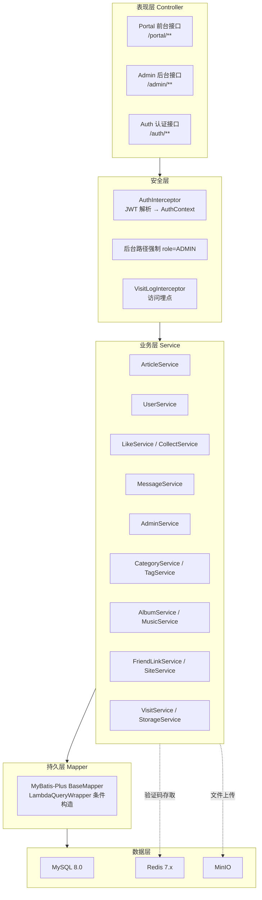

---

## 二、业务流程设计

### 2.1 用户注册流程（手机号 / 邮箱，至少填一项）

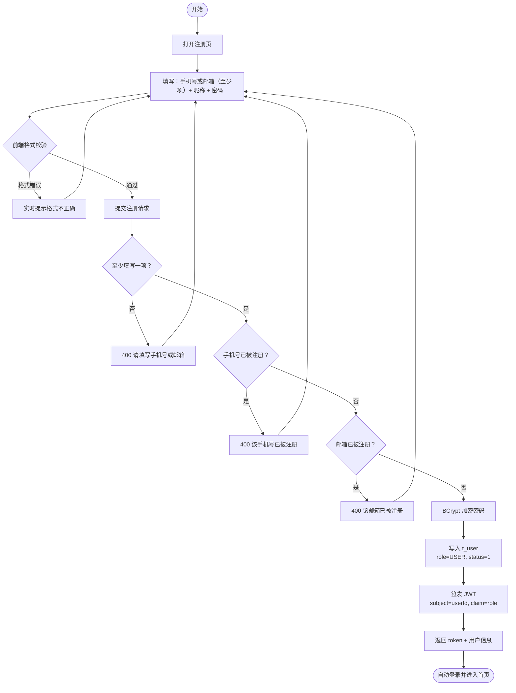

### 2.2 用户登录流程

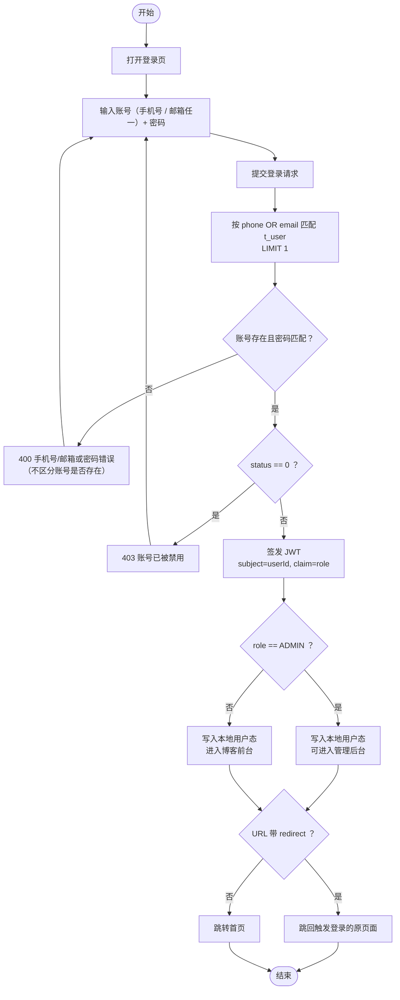

### 2.3 博客前台访问流程

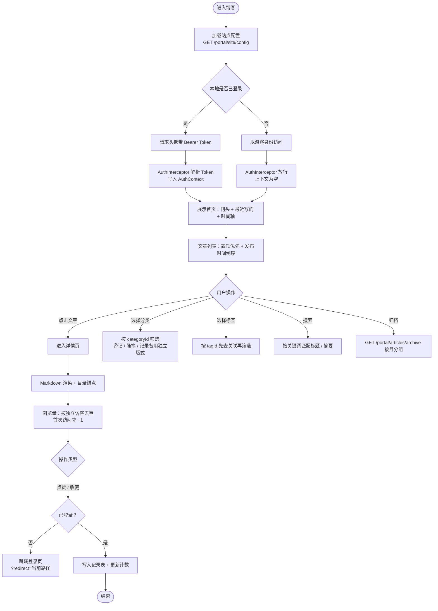

### 2.4 文章发布流程（草稿 / 发布 / 隐藏）

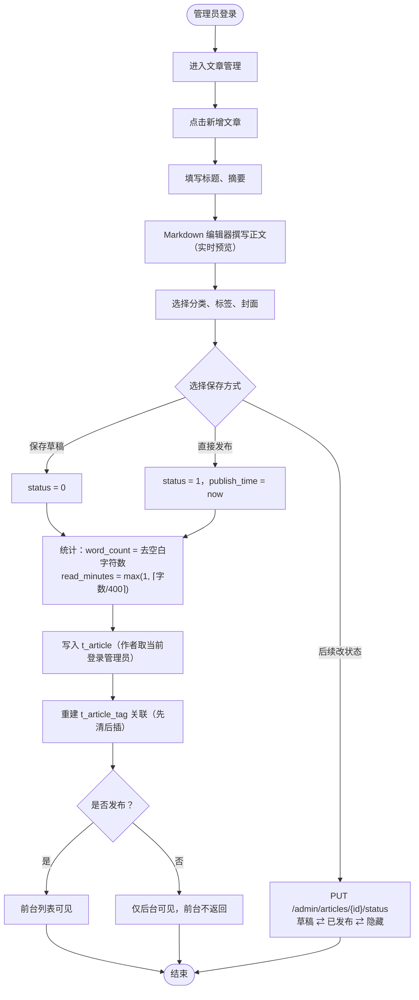

### 2.5 点赞 / 收藏流程（账号维度）

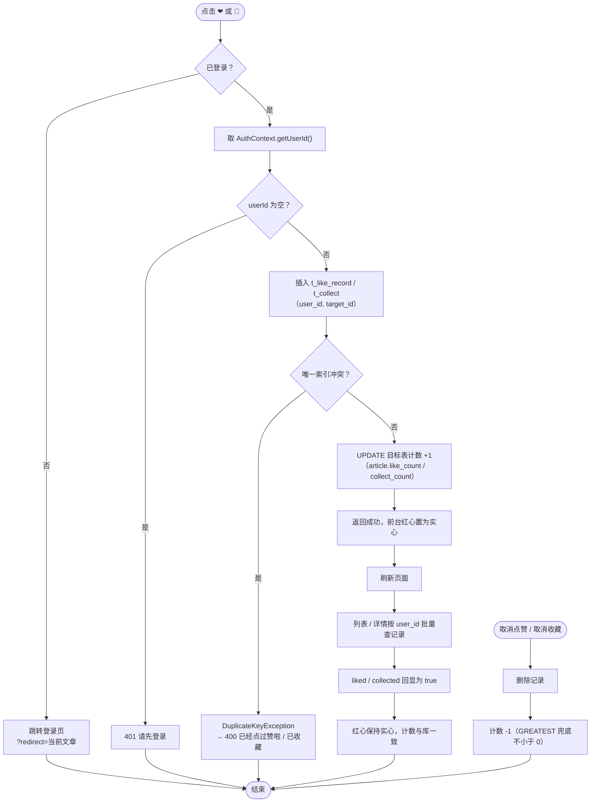

**设计要点**：去重由数据库唯一索引承担，不依赖 Redis 或内存；"是否点过赞"由记录表回显，因此刷新、换设备、换会话都能正确恢复——这是修复"刷新后红心消失"问题后的最终方案（详见数据库设计文档 3.6）。

### 2.6 留言板（文字雨）流程

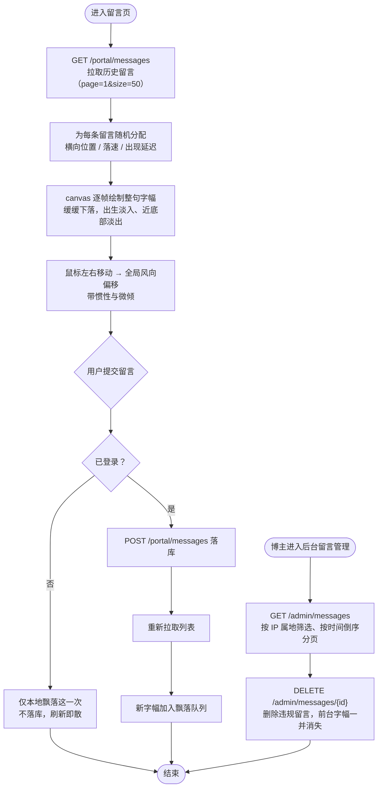

**设计要点**：整句字幅在 canvas 上统一绘制，而非为每句留言生成独立 DOM 节点——留言数量增长时只增加绘制指令，不增加布局与合成开销；飘出视野的字幅从另一侧回收复用，避免对象无限增长。

### 2.7 数据看板统计流程

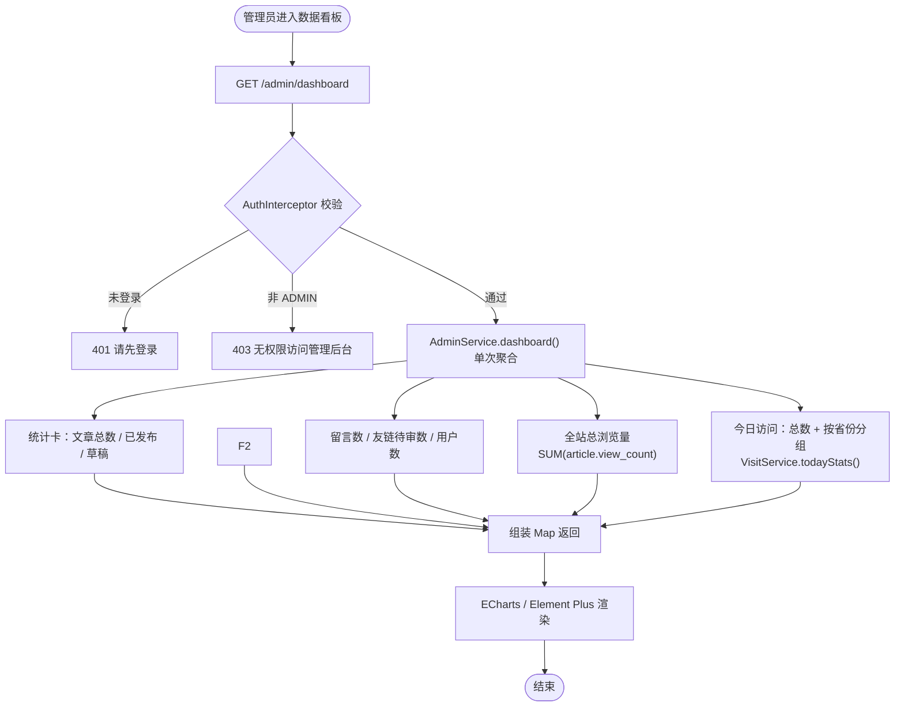

### 2.8 后台权限校验流程

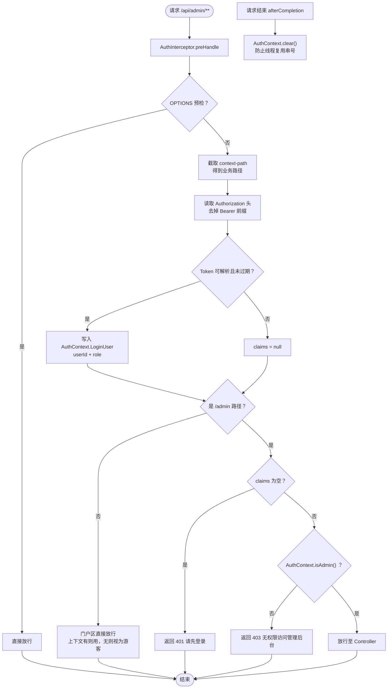

**实现说明**：鉴权由 Spring MVC 拦截器（`AuthInterceptor`）统一完成，而非 Spring Security 过滤器链；错误响应采用 **HTTP 200 + 业务码**（`code` 401 / 403），前端统一按 `code` 判断并处理。

### 2.9 预留流程（设计已定义，本期未实现）

| 流程 | 设计要点 | 现状 |
|---|---|---|
| 敏感词过滤 | 词库启动加载进内存构建 Trie 字典树，留言提交时匹配，`level=1` 替换为 `***`、`level=2` 直接拒绝 | 未实现，预留表 `t_sensitive_word` |
| 文章版本历史 | 每次保存写全量快照入 `t_article_history`，版本号应用层递增，支持版本列表与一键回滚 | 未实现，预留表 `t_article_history` |
| 操作日志 | AOP 切面记录后台关键操作（操作人、模块、动作、URI、IP、耗时、是否成功） | 未实现，预留表 `t_operation_log` |
| 浏览量 Redis 缓冲与热门榜 | Redis Hash 累加 → Spring Task 每 5 分钟批量落库；Redis ZSet 维护热门榜 | 未实现，现为按**独立访客去重**（`t_view_record.uk_article_visitor` 唯一索引 + `INSERT IGNORE`，写入成功才 `view_count + 1`）；热门排行功能在设计后期整体移除，ZSet 榜不在本期范围 |
| 定时发布 | `status=2` + `publish_time`，Spring Task 每分钟扫描自动发布 | 未实现，现为手动切换状态 |
| 接口限流 | `@RateLimit` + Redis 滑动窗口，覆盖登录 / 注册 / 发留言等入口 | 未实现 |

### 2.10 CI/CD 自动化部署流程

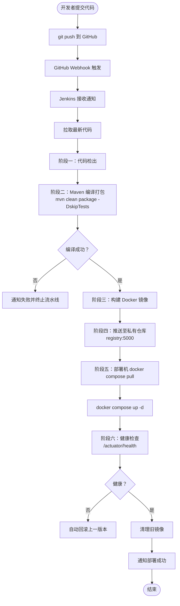

---

## 三、系统用例图

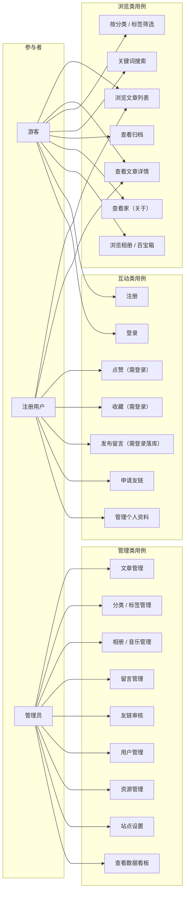

---

## 四、状态机设计

### 4.1 文章状态流转

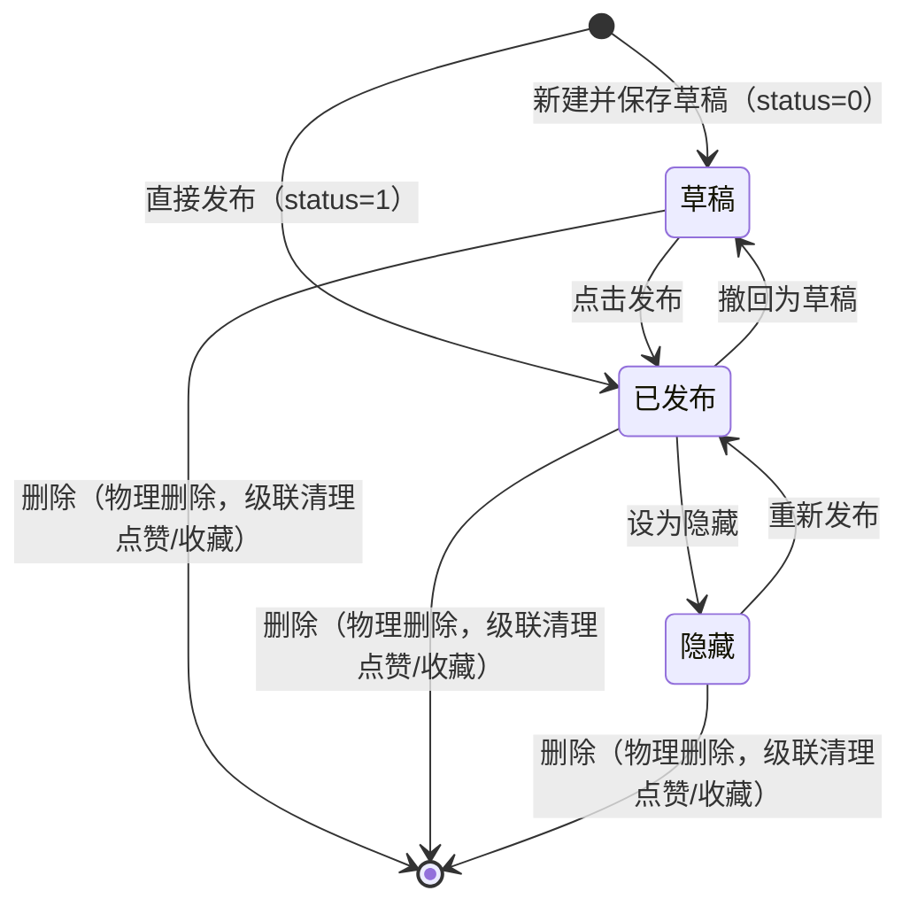

> `定时待发布` 状态与相应流转为后续版本预留（见 2.9），本期不启用。

### 4.2 用户状态流转

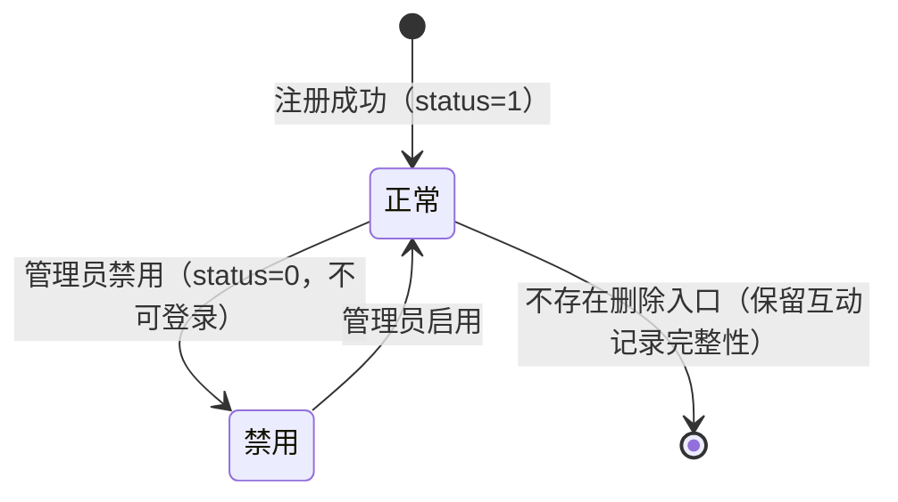

### 4.3 点赞记录流转（按账号）

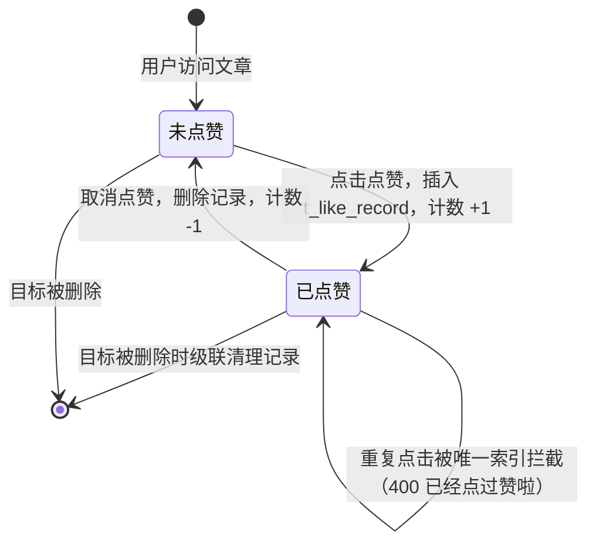

---

*文档结束*
