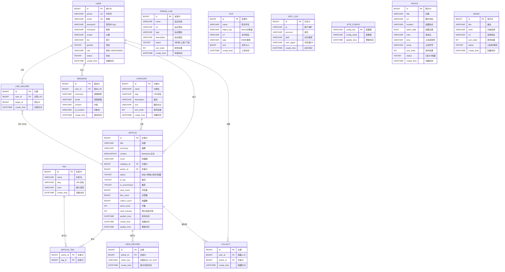
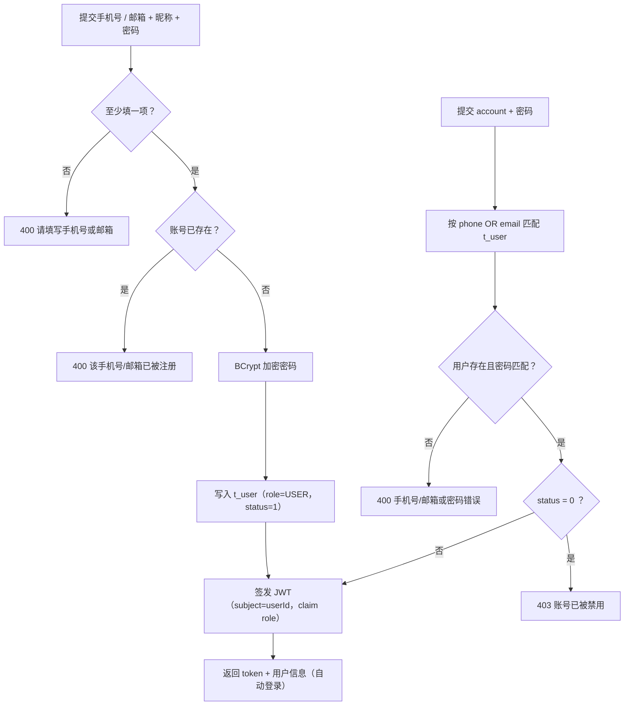
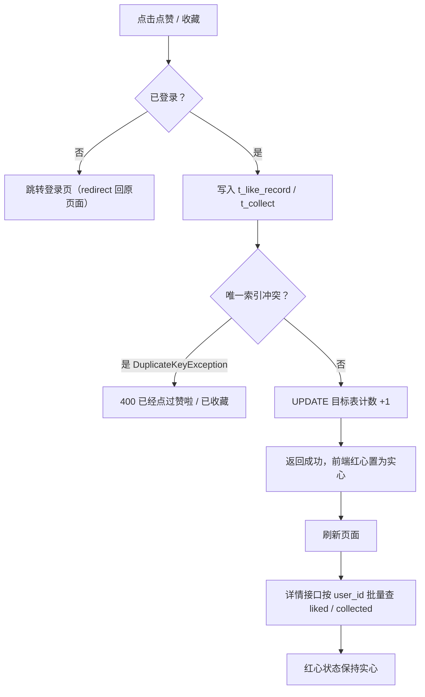
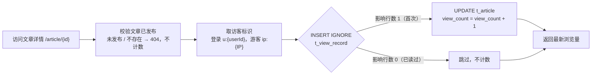
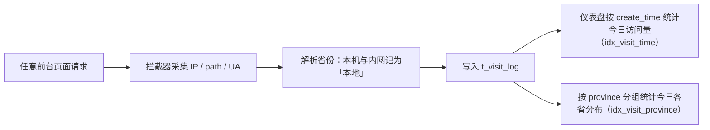
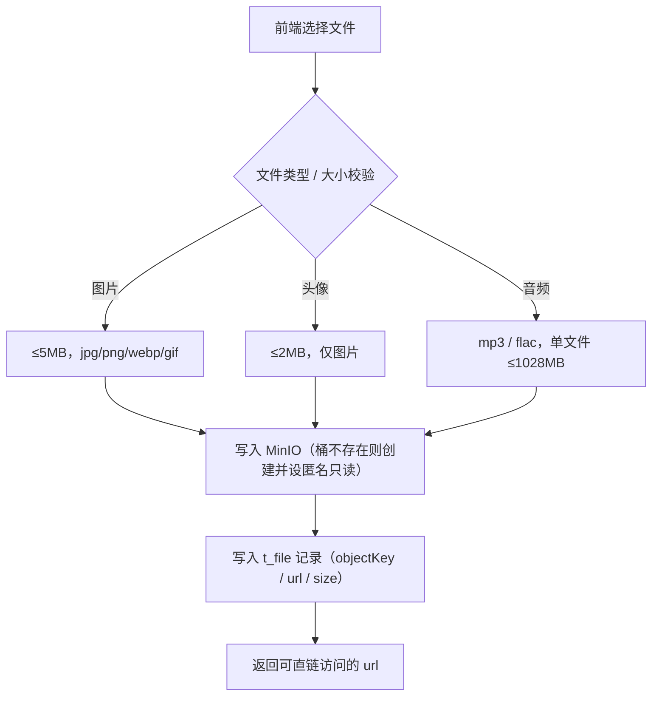

# 简柚个人博客系统 — 数据库设计文档

> 数据库名：`jianyou_blog`　版本：MySQL 8.0+
> 字符集：`utf8mb4`　排序规则：`utf8mb4_unicode_ci`
> 表数量：**15 张**（另有 3 张预留扩展表，本期未建表，见 3.16）
> 本文档所有字段与索引均与线上实际表结构一致（以 `SHOW CREATE TABLE` 实测结果为准）

---

## 一、数据库设计原则

### 1.1 表名规范

物理表名统一采用 `t_` 前缀，便于与 MySQL 系统表、中间表区分。本文档正文与 ER 图中为排版简洁，使用**去掉前缀的逻辑名**，对应关系如下：

| 文档逻辑名 | 物理表名 | 中文名称 |
|---|---|---|
| user | `t_user` | 用户表 |
| category | `t_category` | 分类表 |
| tag | `t_tag` | 标签表 |
| article | `t_article` | 文章表 |
| article_tag | `t_article_tag` | 文章标签关联表 |
| like_record | `t_like_record` | 点赞记录表 |
| collect | `t_collect` | 收藏表 |
| view_record | `t_view_record` | 文章浏览记录表 |
| message | `t_message` | 留言表 |
| friend_link | `t_friend_link` | 友链表 |
| file | `t_file` | 上传资源表 |
| visit_log | `t_visit_log` | 访问日志埋点表 |
| site_config | `t_site_config` | 站点配置表 |
| photo | `t_photo` | 相册照片表 |
| music | `t_music` | 背景音乐表 |

### 1.2 设计原则

1. **规范化**：遵循第三范式（3NF），消除传递依赖；对高频统计字段（`view_count`、`like_count` 等）采用有意冗余，以空间换查询性能。
2. **主键策略**：统一 `BIGINT` 自增主键，避免 INT 溢出风险；纯关联表使用联合主键（如 `t_article_tag`）。
3. **字符集统一**：全部使用 `utf8mb4` / `utf8mb4_unicode_ci`，支持 Emoji 存储（留言场景必需）。
4. **统一审计字段**：`create_time` 全表统一的创建时间，默认值 `CURRENT_TIMESTAMP`；需追踪修改的表（`t_article`、`t_site_config`）额外含 `update_time`。
5. **删除策略：物理删除**。本期未采用 `deleted` 逻辑删除字段，理由有二：一是毕设数据量小，误删可从备份恢复；二是逻辑删除会让 `deleted = 0` 条件侵入所有查询、并使唯一索引（如手机号唯一）在"删除后能否复用"上产生歧义。删除文章时由服务层显式级联清理其点赞、收藏记录。
6. **关联完整性**：不建物理外键约束，关联关系由服务层保证，所有关联列统一建立索引以支撑连接查询。
7. **索引策略**：高频过滤组合建立联合索引；状态、排序字段建立普通索引；遵循最左前缀原则。
8. **检索策略**：关键词搜索当前基于 `title` / `summary` 的 `LIKE` 匹配实现（见 3.4 设计要点与 §四说明）；`ngram` 全文索引方案已在 3.4 中给出并作为后续优化项保留。

---

## 二、实体关系图（ER 图）



---

## 三、表结构详细设计

### 3.1 user — 用户表

**表说明**：存储系统全部用户信息，包括管理员（博主）与注册用户。**只支持手机号或邮箱两种注册方式，不设用户名字段**。

| 字段名 | 类型 | 长度 | 允许空 | 键/约束 | 默认值 | 说明 |
|---|---|---|---|---|---|---|
| id | BIGINT | 20 | 否 | PK, AUTO_INCREMENT | — | 用户ID |
| phone | VARCHAR | 20 | 是 | UNIQUE | NULL | 手机号（登录标识一） |
| email | VARCHAR | 100 | 是 | UNIQUE | NULL | 邮箱（登录标识二） |
| password | VARCHAR | 100 | 是 | — | NULL | 密码（BCrypt 密文，由应用写入） |
| nickname | VARCHAR | 30 | 否 | — | — | 昵称 |
| avatar | VARCHAR | 300 | 是 | — | NULL | 头像URL（MinIO） |
| message_bg | VARCHAR | 300 | 是 | — | NULL | 留言页自定义背景图地址（NULL=默认夜空底图） |
| bio | VARCHAR | 200 | 是 | — | NULL | 个人简介 |
| gender | TINYINT | 4 | 否 | — | 0 | 性别 0未知 1男 2女 |
| role | VARCHAR | 10 | 否 | — | USER | 角色 USER/ADMIN |
| status | TINYINT | 4 | 否 | — | 1 | 状态 0禁用 1正常 |
| create_time | DATETIME | — | 否 | — | CURRENT_TIMESTAMP | 创建时间 |

**索引**：`PRIMARY(id)`、`uk_phone(phone)`、`uk_email(email)`

**设计要点**：
- **全站没有用户名字段**。唯一登录标识只有手机号与邮箱两者之一，登录接口 `account` 参数按 `phone OR email` 匹配。
- `phone` 与 `email` 均为 UNIQUE，但在 MySQL 中 NULL 值不参与唯一性约束，因此两字段允许同时为 NULL；业务层（`RegisterDTO` 的 `@AssertTrue` 跨字段校验）保证**至少填写其一**。
- `password` 允许为 NULL：种子数据不写死明文密码，由 `DataLoader` 在应用启动时以手机号 / 邮箱为锚点补写 BCrypt 密文；`password` 为空的账号不可登录。
- 管理员通过 `role = 'ADMIN'` 标识，不使用独立的管理员表，简化权限模型。
- `message_bg` 用于让登录用户为留言页更换自定义背景图，取值为对象存储上的图片地址；为空时留言页回落到默认的墨绿夜空底图，因此该字段可空且不影响页面渲染。
- 无物理删除入口，用户管理只提供"禁用 / 启用"，以保证互动记录（留言、点赞、收藏）的引用完整性。

---

### 3.2 category — 分类表

| 字段名 | 类型 | 长度 | 允许空 | 键/约束 | 默认值 | 说明 |
|---|---|---|---|---|---|---|
| id | BIGINT | 20 | 否 | PK | — | 分类ID |
| name | VARCHAR | 30 | 否 | — | — | 分类名 |
| slug | VARCHAR | 50 | 是 | — | NULL | URL 别名 |
| description | VARCHAR | 100 | 是 | — | NULL | 分类描述 |
| icon | VARCHAR | 30 | 是 | — | NULL | 图标标识（前端映射为矢量图标） |
| sort_order | INT | 11 | 否 | — | 0 | 排序权重，越小越靠前 |
| create_time | DATETIME | — | 否 | — | CURRENT_TIMESTAMP | 创建时间 |

**索引**：`PRIMARY(id)`

**设计说明**：分类与文章为**一对多**关系，一篇文章只属于一个分类。前台导航与分类列表按 `sort_order` 升序排列。内置三个分类：记录（id=1）、游记（id=2）、随笔（id=3）。

---

### 3.3 tag — 标签表

| 字段名 | 类型 | 长度 | 允许空 | 键/约束 | 默认值 | 说明 |
|---|---|---|---|---|---|---|
| id | BIGINT | 20 | 否 | PK | — | 标签ID |
| name | VARCHAR | 30 | 否 | — | — | 标签名 |
| slug | VARCHAR | 50 | 是 | — | NULL | URL 别名 |
| color | VARCHAR | 10 | 是 | — | NULL | 展示颜色（十六进制） |
| create_time | DATETIME | — | 否 | — | CURRENT_TIMESTAMP | 创建时间 |

**索引**：`PRIMARY(id)`

**设计说明**：标签与文章为**多对多**关系，通过 `article_tag` 中间表实现。`color` 供前台标签胶囊着色。

---

### 3.4 article — 文章表

**表说明**：系统核心表，存储文章全部内容与统计数据。

| 字段名 | 类型 | 长度 | 允许空 | 键/约束 | 默认值 | 说明 |
|---|---|---|---|---|---|---|
| id | BIGINT | 20 | 否 | PK | — | 文章ID |
| title | VARCHAR | 120 | 否 | — | — | 标题 |
| summary | VARCHAR | 300 | 否 | — | — | 摘要 |
| content | MEDIUMTEXT | — | 否 | — | — | 正文（Markdown 原文） |
| cover | VARCHAR | 300 | 是 | — | NULL | 封面图URL |
| category_id | BIGINT | 20 | 是 | 关联 category.id | NULL | 分类ID |
| author_id | BIGINT | 20 | 否 | 关联 user.id | — | 作者ID |
| status | TINYINT | 4 | 否 | — | 0 | 0草稿 1已发布 2隐藏 |
| is_top | TINYINT(1) | 1 | 否 | — | 0 | 是否置顶 |
| is_recommend | TINYINT(1) | 1 | 否 | — | 0 | 是否推荐 |
| view_count | BIGINT | 20 | 否 | — | 0 | 浏览量（口径：读过该文的独立访客数，见 4.3） |
| like_count | BIGINT | 20 | 否 | — | 0 | 点赞数 |
| collect_count | BIGINT | 20 | 否 | — | 0 | 收藏数 |
| word_count | INT | 11 | 否 | — | 0 | 字数（去空白后的字符数） |
| read_minutes | INT | 11 | 否 | — | 1 | 预计阅读分钟数 |
| publish_time | DATETIME | — | 是 | — | NULL | 发布时间 |
| create_time | DATETIME | — | 否 | — | CURRENT_TIMESTAMP | 创建时间 |
| update_time | DATETIME | — | 是 | — | NULL, ON UPDATE | 更新时间 |

**索引**：
- `PRIMARY(id)`
- `idx_category(category_id)` — 按分类取文章列表
- `idx_status_publish(status, publish_time)` — 前台列表（已发布 + 时间倒序）
- `idx_view(view_count)` — 浏览量排序（原为热门排行预留；该功能已整体移除，索引暂留备用）

**设计要点**：
- 作者字段命名为 `author_id`；前台列表只取 `status = 1` 的文章。
- 正文以 **Markdown 原文**存储在 `content` 中，渲染在前端完成，**不落 `content_html` 冗余列**——少一次写放大，也便于正文后续修改渲染规则。
- 统计字段（`view_count` 等）采用**冗余存储**，避免每次列表查询都执行 `COUNT`；更新由服务层在对应业务动作中同步写入。
- `word_count` = 正文去除全部空白字符后的字符数；`read_minutes` = `max(1, ⌈word_count / 400⌉)`，400 为中文平均阅读速度（字/分钟）。
- **检索方式**：当前关键词搜索通过 `title` / `summary` 的 `LIKE '%kw%'` 实现（`ArticleService`）。文章量增长到万级后，可按下述 DDL 增补 ngram 全文索引并改用 `MATCH … AGAINST`，属后续优化项：
  ```sql
  -- 后续优化项（本期未执行）
  ALTER TABLE t_article ADD FULLTEXT KEY ft_title_content (title, summary, content) WITH PARSER ngram;
  ```

---

### 3.5 article_tag — 文章标签关联表

| 字段名 | 类型 | 长度 | 允许空 | 键/约束 | 默认值 | 说明 |
|---|---|---|---|---|---|---|
| article_id | BIGINT | 20 | 否 | 联合主键 | — | 文章ID |
| tag_id | BIGINT | 20 | 否 | 联合主键 | — | 标签ID |

**索引**：`PRIMARY(article_id, tag_id)`、`idx_tag(tag_id)`

**设计说明**：以 `(article_id, tag_id)` 作为**联合主键**，天然防止重复关联，因此不再额外建唯一索引；`idx_tag(tag_id)` 支撑"按标签查文章"。按标签筛选时服务层先取出 tag 对应的 article_id 集合，再以 `IN` 过滤文章。

---

### 3.6 like_record — 点赞记录表

| 字段名 | 类型 | 长度 | 允许空 | 键/约束 | 默认值 | 说明 |
|---|---|---|---|---|---|---|
| id | BIGINT | 20 | 否 | PK | — | 点赞ID |
| user_id | BIGINT | 20 | 否 | 关联 user.id | — | 点赞人ID |
| target_id | BIGINT | 20 | 否 | — | — | 目标文章ID |
| create_time | DATETIME | — | 否 | — | CURRENT_TIMESTAMP | 点赞时间 |

**索引**：`PRIMARY(id)`、`uk_user_article(user_id, target_id)`、`idx_target(target_id)`

**设计说明（账号维度点赞）**：
- 唯一索引 `uk_user_article` 从数据库层面保证**同一用户对同一篇文章只能点一次赞**。
- **点赞是登录用户的动作**：`user_id` 不可为空。未登录用户点击点赞按钮时，前端引导至登录页（与"收藏"行为一致）。
- 点赞 / 取消采用**"插入 / 删除记录 + 同步计数"双写策略**：写入本表成功后，通过 `UPDATE ... SET like_count = like_count ± 1` 同步 `t_article.like_count`。
- **并发兜底**：高并发下两个请求可能同时通过"是否已点赞"的前置查询，此时由唯一索引拦住第二条插入，服务层捕获 `DuplicateKeyException` 并转为业务提示"已经点过赞啦"（HTTP 400），保证不出现重复记录、计数也不会多加。
- **前端红心回显**：`ArticleVO` 的 `liked` 字段由本表批量查询得出（`WHERE user_id = ? AND target_id IN (...)`），未登录时恒为 `false`。这是"刷新页面后红心是否保持"的数据依据——点赞状态落库而非依赖缓存，因此可跨会话、跨设备稳定回显。
- 取消点赞删除记录后，计数使用 `GREATEST(like_count - 1, 0)` 更新，避免异常情况下出现负数。

---

### 3.7 collect — 收藏表

| 字段名 | 类型 | 长度 | 允许空 | 键/约束 | 默认值 | 说明 |
|---|---|---|---|---|---|---|
| id | BIGINT | 20 | 否 | PK | — | 收藏ID |
| user_id | BIGINT | 20 | 否 | 关联 user.id | — | 收藏人ID |
| article_id | BIGINT | 20 | 否 | 关联 article.id | — | 被收藏文章ID |
| create_time | DATETIME | — | 否 | — | CURRENT_TIMESTAMP | 收藏时间 |

**索引**：`PRIMARY(id)`、`uk_user_article(user_id, article_id)`、`idx_user_time(user_id, create_time)`、`idx_article(article_id)`

**设计说明**：
- `uk_user_article` 联合唯一索引保证同一用户对同一文章只能收藏一次，并发冲突同样以 `DuplicateKeyException` 兜底。
- `idx_user_time(user_id, create_time)` 直接支撑"我的收藏"按收藏时间倒序分页；`idx_article` 支撑文章维度的收藏数统计与级联清理。
- 收藏与点赞均为**登录后可用**；未登录调用收藏接口返回 401。

---

### 3.8 message — 留言表

**表说明**：留言板（前台呈现为文字雨）的数据表。

| 字段名 | 类型 | 长度 | 允许空 | 键/约束 | 默认值 | 说明 |
|---|---|---|---|---|---|---|
| id | BIGINT | 20 | 否 | PK | — | 留言ID |
| user_id | BIGINT | 20 | 是 | 关联 user.id | NULL | 留言人，游客为 NULL |
| nickname | VARCHAR | 30 | 是 | — | NULL | 游客昵称 |
| email | VARCHAR | 100 | 是 | — | NULL | 游客邮箱（不回显） |
| content | VARCHAR | 400 | 否 | — | — | 留言内容 |
| ip_location | VARCHAR | 30 | 是 | — | NULL | IP属地（由 **ip2region 离线 xdb** 解析：省份名 / 「本地」/ 境外国家名 / 「未知」） |
| create_time | DATETIME | — | 否 | — | CURRENT_TIMESTAMP | 留言时间 |

**索引**：`PRIMARY(id)`、`idx_create(create_time)`

**设计说明**：允许匿名留言，故 `user_id` 可空，匿名时以 `nickname` 记录显示名；`email` 仅作联系用途、前台不回显。留言板为**单层留言**，不设回复链路（后台只提供按 IP 属地筛选与删除）。`idx_create` 支撑文字雨按时间倒序拉取历史留言。

---

### 3.9 friend_link — 友链表

| 字段名 | 类型 | 长度 | 允许空 | 键/约束 | 默认值 | 说明 |
|---|---|---|---|---|---|---|
| id | BIGINT | 20 | 否 | PK | — | 友链ID |
| name | VARCHAR | 30 | 否 | — | — | 站点名称 |
| url | VARCHAR | 200 | 否 | — | — | 站点地址 |
| logo | VARCHAR | 300 | 是 | — | NULL | 站点图标 |
| description | VARCHAR | 60 | 是 | — | NULL | 站点描述 |
| status | TINYINT | 4 | 否 | — | 0 | 0待审核 1已上架 2下架 |
| sort_order | INT | 11 | 否 | — | 0 | 排序权重 |
| create_time | DATETIME | — | 否 | — | CURRENT_TIMESTAMP | 申请时间 |

**索引**：`PRIMARY(id)`

**设计说明**：访客提交的友链申请初始 `status = 0`（待审核），后台审核通过后置为 1 才在前台百宝箱页展示；申请时校验站点地址是否已存在，防止重复提交。

---

### 3.10 file — 上传资源表

**表说明**：记录上传到 MinIO 的对象，供后台资源管理与清理。

| 字段名 | 类型 | 长度 | 允许空 | 键/约束 | 默认值 | 说明 |
|---|---|---|---|---|---|---|
| id | BIGINT | 20 | 否 | PK | — | 资源ID |
| name | VARCHAR | 200 | 否 | — | — | 原文件名 |
| object_key | VARCHAR | 300 | 否 | — | — | MinIO 对象键 |
| url | VARCHAR | 500 | 否 | — | — | 访问地址 |
| type | VARCHAR | 50 | 是 | — | NULL | MIME 类型 |
| size | BIGINT | 20 | 否 | — | 0 | 文件大小（字节） |
| create_time | DATETIME | — | 否 | — | CURRENT_TIMESTAMP | 上传时间 |

**索引**：`PRIMARY(id)`、`idx_file_create_time(create_time)`

**设计说明**：图片与音频统一走对象存储，桶在首次上传时按需创建并设置匿名只读策略，`url` 即前台可直接使用的直链。删除资源时同步移除 MinIO 对象并删除本记录。上传大小限制见 §四。

---

### 3.11 visit_log — 访问日志埋点表

**表说明**：全站页面访问埋点，是仪表盘"今日访问省份统计"的数据源。

| 字段名 | 类型 | 长度 | 允许空 | 键/约束 | 默认值 | 说明 |
|---|---|---|---|---|---|---|
| id | BIGINT | 20 | 否 | PK | — | 日志ID |
| ip | VARCHAR | 45 | 否 | — | — | 客户端IP（兼容 IPv6 长度） |
| province | VARCHAR | 20 | 否 | — | 未知 | 省份（由 **ip2region 离线 xdb** 在写入时解析；本机 / 内网与 xdb 的 `Reserved` 段记为「本地」，境外 IP 记国家名，IPv6 记「未知」） |
| path | VARCHAR | 200 | 否 | — | — | 访问路径 |
| user_agent | VARCHAR | 300 | 是 | — | NULL | 浏览器 UA |
| create_time | DATETIME | — | 否 | — | CURRENT_TIMESTAMP | 访问时间 |

**索引**：`PRIMARY(id)`、`idx_visit_time(create_time)`、`idx_visit_province(province, create_time)`

**设计说明**：
- 埋点由拦截器统一写入，业务代码无需关心。
- 访问趋势按 `create_time` 分组统计（命中 `idx_visit_time`）；"今日各省访问分布"按 `province + create_time` 组合查询（命中 `idx_visit_province`），避免函数计算导致索引失效。
- 本表为增长最快的表（预估 50 万行/年），规划按月归档（见 §六）。

---

### 3.12 site_config — 站点配置表

| 字段名 | 类型 | 长度 | 允许空 | 键/约束 | 默认值 | 说明 |
|---|---|---|---|---|---|---|
| config_key | VARCHAR | 50 | 否 | PK | — | 配置键（与 `site.*` kebab-case 一致，如 `site-name`） |
| config_value | VARCHAR | 2000 | 是 | — | NULL | 配置值 |
| update_time | DATETIME | — | 否 | — | CURRENT_TIMESTAMP, ON UPDATE | 更新时间 |

**索引**：`PRIMARY(config_key)`

**设计说明**：采用 **Key-Value 垂直表**设计，新增配置项无需修改表结构。**数据库中的值覆盖 `application.yml` 中 `site.*` 的默认值**：管理后台"网站设置"写入本表，无记录的键回落 yml 默认值，因此空库也能正常启动。配置读写封装在 `SiteService` 中。

---

### 3.13 photo — 相册照片表

**表说明**：前台相册页（瀑布流）的数据表。

| 字段名 | 类型 | 长度 | 允许空 | 键/约束 | 默认值 | 说明 |
|---|---|---|---|---|---|---|
| id | BIGINT | 20 | 否 | PK | — | 照片ID |
| title | VARCHAR | 60 | 否 | — | — | 标题 |
| url | VARCHAR | 500 | 是 | — | NULL | 图片地址（MinIO）；为空时前台用渐变占位 |
| location | VARCHAR | 60 | 是 | — | NULL | 拍摄地点 |
| taken_date | DATE | — | 是 | — | NULL | 拍摄日期 |
| ratio | VARCHAR | 10 | 否 | — | 1/1 | 宽高比（如 `3/4`），瀑布流占位用 |
| tone | VARCHAR | 120 | 是 | — | NULL | 占位渐变色（`url` 为空时显示） |
| emoji | VARCHAR | 10 | 是 | — | NULL | 占位符号（`url` 为空时显示） |
| sort_order | INT | 11 | 否 | — | 0 | 排序权重，越小越靠前 |
| status | TINYINT | 4 | 否 | — | 1 | 1显示 2隐藏 |
| create_time | DATETIME | — | 否 | — | CURRENT_TIMESTAMP | 创建时间 |

**索引**：`PRIMARY(id)`、`idx_photo_sort(status, sort_order)`

**设计说明**：
- 相册采用**单表扁平结构**，不设分组表；一条照片记录即一张卡片，`location` / `taken_date` 承担描述维度的展示。
- `ratio` 由前端用于计算瀑布流占位高度，避免图片加载完成前的布局跳动；`url` 为空时以 `tone` 渐变 + `emoji` 渲染占位图，使演示环境无图也能完整呈现版式。
- `idx_photo_sort(status, sort_order)` 直接支撑"取显示中的照片、按权重升序"这一唯一高频查询。

---

### 3.14 music — 背景音乐表

| 字段名 | 类型 | 长度 | 允许空 | 键/约束 | 默认值 | 说明 |
|---|---|---|---|---|---|---|
| id | BIGINT | 20 | 否 | PK | — | 音乐ID |
| title | VARCHAR | 60 | 否 | — | — | 曲名 |
| artist | VARCHAR | 60 | 是 | — | NULL | 作者 / 来源 |
| url | VARCHAR | 500 | 否 | — | — | 音频直链或 MinIO 地址 |
| sort_order | INT | 11 | 否 | — | 0 | 排序权重，越小越靠前 |
| status | TINYINT | 4 | 否 | — | 1 | 1启用 2停用 |
| create_time | DATETIME | — | 否 | — | CURRENT_TIMESTAMP | 创建时间 |

**索引**：`PRIMARY(id)`、`idx_music_sort(status, sort_order)`

**设计说明**：全站 BGM 歌单，前台启动时从 `/portal/music` 拉取启用中的曲目并顺序播放；`url` 既可为外链示例曲，也可为 MinIO 上传的音频直链。

---

### 3.15 view_record — 文章浏览记录表

| 字段名 | 类型 | 长度 | 允许空 | 键/约束 | 默认值 | 说明 |
|---|---|---|---|---|---|---|
| id | BIGINT | 20 | 否 | PK | — | 浏览记录ID |
| article_id | BIGINT | 20 | 否 | FK / 联合唯一 | — | 被浏览文章ID |
| visitor_key | VARCHAR | 64 | 否 | 联合唯一 | — | 访客标识：登录用户 `u:{userId}`；游客 `ip:{客户端IP}` |
| create_time | DATETIME | — | 否 | — | CURRENT_TIMESTAMP | 首次浏览时间 |

**索引**：`PRIMARY(id)`、`uk_article_visitor(article_id, visitor_key)`（唯一）、`idx_article(article_id)`

**设计说明**：

- **本表是浏览量的计数依据**。文章详情接口在处理请求时先尝试写入本表（`INSERT IGNORE`）：
  写入成功说明这是该访客第一次读这篇文章，才让 `t_article.view_count + 1`；写入被唯一索引挡下则说明已读过，**不计数**。
  这样浏览量口径为「**读过这篇文章的独立访客数**」，而非「详情页被打开的次数」——访客反复刷新、浏览器前进后退、刷新调试都不会把数字刷高。
- **去重由唯一索引承担，不依赖 Redis 或内存状态**：与 `t_like_record`、`t_collect` 是同一套做法，
  天然支持多实例部署与服务重启后状态不丢，也避免了 Redis 不可用时的降级分支。
- **`visitor_key` 的取法**：已登录用户取 `u:{userId}`（换设备、换网络都算同一人）；
  未登录游客取 `ip:{客户端IP}`。后者会把同一网络出口（如宿舍共用宽带、校园网 NAT）下的多个访客合并计一次，
  这是无登录态站点的常见近似，取舍理由见选题方案「未落地清单」。
- **与 `t_visit_log` 的区别**：`t_visit_log` 是**站点级访问埋点**（由拦截器对 `/portal/**` 异步记录 IP、省份、路径、UA），
  用于后台「今日访问量 + 省份分布」；本表是**文章级去重台账**，用于文章浏览量。两者互不替代。
- 表内不预置种子数据：浏览量从真实访问累计，预置会与 `t_article.view_count` 对不上账。

---

### 3.16 预留扩展表（设计保留，本期未建表）

以下三张表在概要设计阶段已完成结构定义，**本期版本未在数据库中建表、未编写对应业务代码**。此处保留设计以便后续版本扩展，并在答辩时说明取舍：本期优先保证"已实现功能闭环可用"，将这三项列入迭代计划。

| 表名 | 中文名称 | 用途 | 未实现原因 |
|---|---|---|---|
| sensitive_word | 敏感词表 | 留言的敏感词过滤词库 | 本期内容均为本人自建数据、无外部用户输入压力，先以确保核心链路可用为先 |
| article_history | 文章版本历史表 | 文章全量快照与版本回滚 | 文章由博主维护，Git 已在工程层承担版本管理职责 |
| operation_log | 操作日志表 | 后台关键操作留痕（操作人 / 动作 / IP / 时间） | 后台为单管理员使用，审计需求弱 |

**预留结构定义（供后续建表参考）**：

```sql
-- 敏感词表
CREATE TABLE t_sensitive_word (
  id          BIGINT      NOT NULL AUTO_INCREMENT COMMENT '主键',
  word        VARCHAR(50) NOT NULL                COMMENT '敏感词',
  level       TINYINT     NOT NULL DEFAULT 1      COMMENT '1替换为* 2直接拒绝',
  create_time DATETIME    NOT NULL DEFAULT CURRENT_TIMESTAMP COMMENT '创建时间',
  PRIMARY KEY (id),
  UNIQUE KEY uk_word (word)
) ENGINE=InnoDB DEFAULT CHARSET=utf8mb4 COMMENT='敏感词表';

-- 文章版本历史表（全量快照，非增量 Diff）
CREATE TABLE t_article_history (
  id          BIGINT       NOT NULL AUTO_INCREMENT COMMENT '主键',
  article_id  BIGINT       NOT NULL COMMENT '文章ID',
  version     INT          NOT NULL DEFAULT 1 COMMENT '版本号',
  title       VARCHAR(200) NOT NULL COMMENT '标题快照',
  summary     VARCHAR(500) NULL COMMENT '摘要快照',
  content     MEDIUMTEXT   NOT NULL COMMENT '内容快照（Markdown）',
  editor_id   BIGINT       NOT NULL COMMENT '编辑人ID',
  change_note VARCHAR(255) NULL COMMENT '修改说明',
  create_time DATETIME     NOT NULL DEFAULT CURRENT_TIMESTAMP COMMENT '创建时间',
  PRIMARY KEY (id),
  KEY idx_article_version (article_id, version)
) ENGINE=InnoDB DEFAULT CHARSET=utf8mb4 COMMENT='文章版本历史表';

-- 操作日志表
CREATE TABLE t_operation_log (
  id          BIGINT       NOT NULL AUTO_INCREMENT COMMENT '主键',
  user_id     BIGINT       NULL COMMENT '操作人ID',
  module      VARCHAR(50)  NULL COMMENT '模块',
  operation   VARCHAR(100) NULL COMMENT '操作描述',
  request_uri VARCHAR(200) NULL COMMENT '请求地址',
  ip          VARCHAR(45)  NULL COMMENT '操作IP',
  cost_time   BIGINT       NULL COMMENT '耗时（ms）',
  success     TINYINT      NOT NULL DEFAULT 1 COMMENT '是否成功',
  create_time DATETIME     NOT NULL DEFAULT CURRENT_TIMESTAMP COMMENT '创建时间',
  PRIMARY KEY (id),
  KEY idx_create (create_time)
) ENGINE=InnoDB DEFAULT CHARSET=utf8mb4 COMMENT='操作日志表';
```

---

## 四、关键数据流程

### 4.1 注册、登录与鉴权



**鉴权设计要点**：
- JWT 载荷只放 `userId`（subject）与 `role`（claim），**不放用户名**（系统中不存在该字段）。
- 服务端以拦截器解析 Token 并写入 `AuthContext`（ThreadLocal），请求结束后 `afterCompletion` 清理，避免线程复用导致的身份串号。
- 接口按三级权限控制：游客可读、注册用户可写互动数据、`role=ADMIN` 可进后台。
- 采用**双 Token**：access（2h，载荷含 `userId` + `role`）与 refresh（7d，载荷含 `userId` + `jti`，不含角色）；
  两者带 `type` claim 不可混用，请求凭证只认 access。refresh 的 `jti` 登记 Redis（`blog:auth:refresh:{jti}`，删除即撤销），
  刷新为轮换制且回库读取最新 `role` / `status`；未做 access 黑名单，靠 2 小时短效期收敛风险。
  **本机制不涉及任何数据表变更**——撤销状态存 Redis，`t_user` 结构不变。

### 4.2 点赞 / 收藏（唯一索引 + 计数双写）



**设计要点**：
- 去重不依赖 Redis 或内存状态，而是**由数据库唯一索引保证**，天然支持多实例与重启后状态不丢。
- 计数与记录在**同一业务方法**中更新，异常时回滚（记录写入失败的场景不会产生计数偏移）。
- "我是否点过赞 / 收藏过"由 `liked` / `collected` 字段回显，来源是记录表而非缓存，因此刷新、换设备、重开会话都能正确恢复。

### 4.3 浏览量计数（独立访客去重）



**设计要点与取舍**：

- 浏览量口径为「**读过这篇文章的独立访客数**」：同一访客对同一篇文章终身只计一次，
  反复刷新、浏览器前进后退、调试预览都不会把数字刷高。
- 去重**由 `uk_article_visitor(article_id, visitor_key)` 唯一索引承担**，实现为 `INSERT IGNORE`：
  写入成功才执行 `view_count = view_count + 1`（`setSql` 原子自增，InnoDB 行锁保证并发准确）。
  与点赞、收藏同为「唯一索引兜底」的做法，不依赖 Redis 或内存状态，多实例部署与服务重启后状态均不丢。
- **未采用「Redis SETNX 去重」**：Redis 重启或清库后去重窗口会整体失效，
  还会引入「Redis 不可用时是否继续计数」的降级分支；本项目规模下数据库方案更简单，且结果可复现、可核对。
- **已修正早期实现**：详情页一度为「每请求 `view_count + 1`」，该口径下浏览量随刷新线性虚高、
  数值不具参考意义；现改为按访客去重后计数。
- `idx_view` 索引保留但当前不参与查询：原设计用于支撑热门文章排行（按 `view_count` 倒序取 TOP N），
  该功能已于设计后期**整体移除**（前台未接入、后端接口与 Redis 缓存代码一并删除）。
- 全站累计浏览量由 `SUM(t_article.view_count)` 得出，后台仪表盘与前台刊底「共 X 次阅读」共用同一口径
  （原前台为「当页文章列表浏览数求和」，与后台对不上，已统一）。

### 4.4 访问埋点与省份统计



**设计要点**：埋点写入与业务查询解耦；`province` 字段直接存解析结果，使"按省份分组"无需在查询时做转换，可命中 `idx_visit_province`。

### 4.5 图片与音频上传



**设计要点**：上传逻辑集中在 `StorageService`，按用途区分校验策略（封面 / 头像 / 音频上限不同）；`t_file` 留痕便于后台资源管理与失效清理。

---

## 五、索引设计说明

| 表 | 索引名 | 字段 | 类型 | 支撑场景 |
|---|---|---|---|---|
| user | uk_phone | phone | UNIQUE | 手机号登录、注册查重 |
| user | uk_email | email | UNIQUE | 邮箱登录、注册查重 |
| article | idx_category | category_id | 普通 | 按分类取文章列表 |
| article | idx_status_publish | status, publish_time | 联合 | 前台列表（已发布 + 时间倒序） |
| article | idx_view | view_count | 普通 | 浏览量排序（暂留备用，当前无查询使用） |
| article_tag | PRIMARY | article_id, tag_id | 联合主键 | 防重复关联 + 查文章标签 |
| article_tag | idx_tag | tag_id | 普通 | 按标签查文章 |
| like_record | uk_user_article | user_id, target_id | 唯一 | **防重复点赞 + 判断是否已点赞** |
| like_record | idx_target | target_id | 普通 | 统计文章点赞数、级联清理 |
| collect | uk_user_article | user_id, article_id | 唯一 | 防重复收藏 + 判断是否已收藏 |
| collect | idx_user_time | user_id, create_time | 联合 | 我的收藏按时间倒序分页 |
| collect | idx_article | article_id | 普通 | 文章收藏数统计、级联清理 |
| view_record | uk_article_visitor | article_id, visitor_key | 唯一 | **浏览量去重（同一访客同一文章只计一次）+ 判断是否已读过** |
| view_record | idx_article | article_id | 普通 | 按文章统计去重浏览数、级联清理 |
| message | idx_create | create_time | 普通 | 文字雨按时间倒序拉取 |
| file | idx_file_create_time | create_time | 普通 | 资源列表按上传时间查询 |
| visit_log | idx_visit_time | create_time | 普通 | 访问趋势按天统计 |
| visit_log | idx_visit_province | province, create_time | 联合 | 今日各省访问分布 |
| photo | idx_photo_sort | status, sort_order | 联合 | 取显示中照片并按权重排序 |
| music | idx_music_sort | status, sort_order | 联合 | 取启用曲目并按权重排序 |

**索引设计原则**：
1. 高频查询条件优先建索引，写多读少的表控制索引数量。
2. 联合索引遵循**最左前缀原则**，将区分度高的字段放左侧（如 `status` + `sort_order`）。
3. 关联表的联合唯一索引同时承担"防重"与"等值查询"两个职责，不重复建索引。
4. 本期未使用逻辑删除字段，因此不存在"是否需要将 `deleted` 纳入索引"的问题；若后续引入逻辑删除，需将 `deleted` 追加到唯一索引末尾以避免历史数据阻塞复用。
5. 全文索引（ngram）作为后续优化项保留，未在执行计划中（见 3.4）。

---

## 六、数据量估算与容量规划

| 表 | 预估年增量 | 单行大小 | 年增数据量 |
|---|---|---|---|
| user | 1,000 | ~500 B | ~0.5 MB |
| article | 500 | ~50 KB | ~25 MB |
| like_record | 50,000 | ~60 B | ~3 MB |
| collect | 5,000 | ~60 B | ~0.3 MB |
| view_record | 100,000 | ~70 B | ~7 MB |
| visit_log | 500,000 | ~300 B | ~150 MB |
| file | 5,000 | ~600 B | ~3 MB |
| photo / music | 1,000 | ~400 B | ~0.4 MB |
| 其他表 | — | — | ~2 MB |
| **合计** | | | **约 197 MB/年** |

**规划建议**：
- `t_visit_log` 为增长最快表，建议按**月分表**或定期归档（保留 6 个月明细，更早数据聚合为日统计表）。
- `t_view_record` 按「文章 × 独立访客」增长，随访客数线性累积；如需控制体量，可按年归档历史记录
  （归档后 `t_article.view_count` 已固化为累计值，不受影响）。
- 生产环境配置 `innodb_buffer_pool_size = 1G`，可完全缓存热数据。
- 图片与音频存于 MinIO（对象存储），不占数据库空间，是本设计"库轻量、媒体外置"的关键。

---

## 七、数据库安全与备份

| 项 | 策略 |
|---|---|
| 账号权限 | 应用使用独立账号，仅授权 `SELECT/INSERT/UPDATE/DELETE`，不授予 `DROP` |
| 密码存储 | 用户密码使用 BCrypt 加盐哈希，不可逆 |
| 敏感字段 | `password` 字段在 API 返回时统一置空，不出现在任何 VO 中 |
| 隐私字段 | 留言只存**脱敏后的 IP 属地**，不落原始 IP |
| SQL 注入防护 | 全部使用 MyBatis-Plus 参数绑定，禁止 `${}` 拼接 |
| 备份策略 | 每日 02:00 全量备份 + binlog 增量备份，保留 7 天 |
| 备份脚本 | `mysqldump --single-transaction --routines --triggers` |
| 恢复演练 | 每月执行一次恢复验证 |

---

*文档结束*
