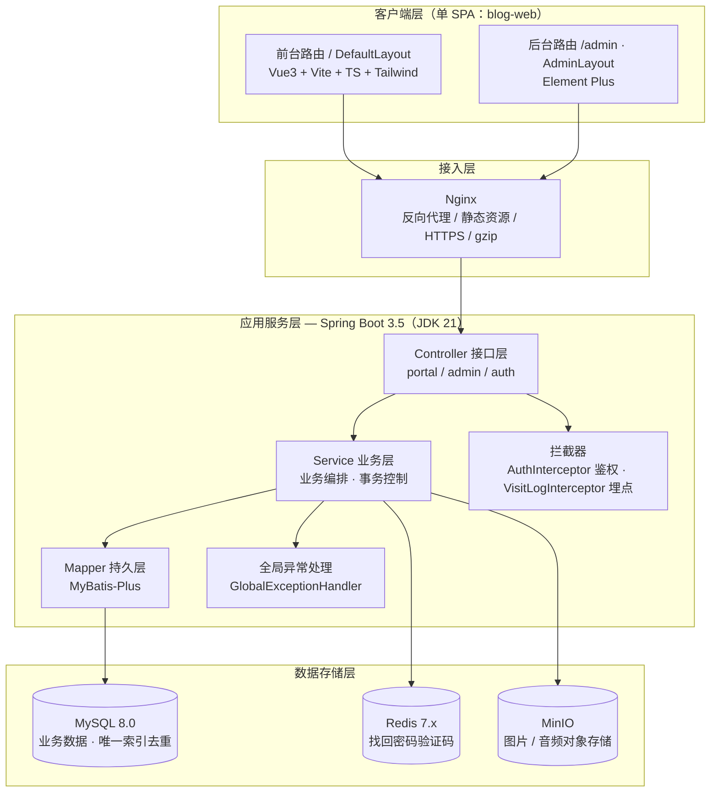
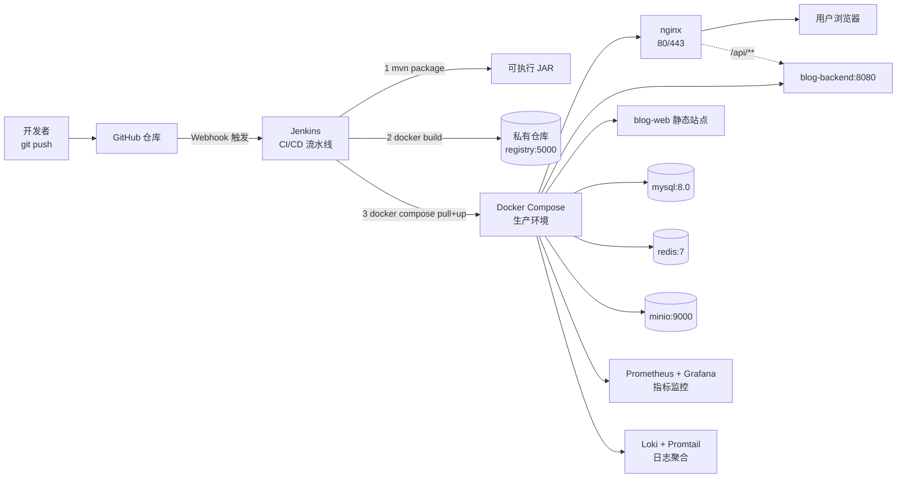

# 简柚个人博客系统 — 系统架构设计

> 学生：简之航　学号：202420330504　班级：软件技术 2-2405
> 版本：v2.0　日期：2026-09-23
> 上游文档：`需求分析.md`（15 张表口径）　配套：`数据库设计文档.md`、`功能结构图与流程图.md`
> 说明：本文档已按**当前实际实现**核对（技术选型、包结构、接口分组、缓存策略均与代码一致）；
> 设计阶段列入但本期未实现的组件（AOP 切面、定时任务、Spring Security 过滤器链等）在 §3.4 单列说明。

---

## 一、总体架构

系统采用前后端分离的 B/S 架构，分为四层：客户端层、接入层、应用服务层、数据存储层。前台与后台是**同一个 Vue 单页应用内的两套路由与布局**（`DefaultLayout` 前台 / `AdminLayout` 后台），共用一套 RESTful API 与设计令牌层。



### 1.1 分层职责

| 层次 | 职责 | 关键技术 |
|---|---|---|
| 客户端层 | 界面渲染、交互响应、路由与状态管理 | Vue 3、Vue Router、Pinia、Axios |
| 接入层 | 反向代理、静态资源、SSL 终止、负载缓冲 | Nginx |
| 接口层 | 参数校验、请求路由、统一响应 `Result<T>` | Spring MVC、Jakarta Validation |
| 业务层 | 业务逻辑编排、事务控制 | Spring、MyBatis-Plus |
| 持久层 | SQL 执行、结果映射、分页 | MyBatis-Plus、HikariCP |
| 数据层 | 持久化、键值存储、对象存储 | MySQL、Redis、MinIO |

---

## 二、前端架构

### 2.1 单应用双布局

| 对比项 | 前台（`/` 及子路由） | 后台（`/admin` 及子路由） |
|---|---|---|
| 面向用户 | 访客、读者 | 博主（管理员） |
| 布局组件 | `DefaultLayout`（AppHeader + Footer + BackToTop） | `AdminLayout`（侧边菜单 + 顶部标签栏 + 内容区） |
| 视觉目标 | 杂志式："墨色刊头 + 暖纸正文" | 工具式：信息密度高、操作高效 |
| UI 方案 | Tailwind CSS 手写 | Element Plus 组件库 |
| 访问控制 | 公开；点赞 / 收藏 / 留言需登录 | 需 `role=ADMIN`，路由守卫拦截 |

### 2.2 设计令牌层（tokens.css）

前后台共享一份 `tokens.css`，把颜色、圆角、阴影、字体、间距全部收敛为 CSS 变量（`--ink-*`、`--paper`、`--orange`、`--green`、`--font-display` 等），主题调整只改一处——这是"视觉统一 + 好维护"的关键。

### 2.3 前台路由与信息架构

| 路由 | 页面组件 | 版式 |
|---|---|---|
| `/` | HomeView（MagazineHero + FeaturedEditorial + TimelineList + 封底） | 墨色刊头 + 暖纸正文 |
| `/about` | AboutView | 墨色刊头 + 暖纸 |
| `/category/2` | TravelView（游记） | 封面卡片流 |
| `/category/3` | EssayView（随笔） | 杂志目录 |
| `/category/1` | RecordView（记录） | 垂直时间轴 |
| `/category/:id` | CategoryView | 通用分类列表 |
| `/tag/:id` | TagView | 按标签筛选列表 |
| `/articles` | ArticleListView | 通用分页列表 |
| `/article/:id` | ArticleDetailView | 正文 + 目录锚点 |
| `/archive` | ArchiveView | 按年月归档 |
| `/search` | SearchView | 关键词搜索结果 |
| `/album` | AlbumView | 瀑布流 + 大图弹层 |
| `/toolbox` | ToolboxView | 工具卡三组 + 友链 |
| `/message` | MessageView | 全屏文字雨留言板（隐藏 Footer / BackToTop，100dvh 不滚动） |
| `/login` `/register` | LoginView / RegisterView | 表单页 |
| `/profile` | ProfileView（含 `ProfileInfoView` / `MyCollectionsView`） | 个人中心 |
| `/:pathMatch(.*)*` | NotFoundView | 404 |

### 2.4 后台路由

| 路由 | 页面组件 |
|---|---|
| `/admin` | DashboardView（数据看板） |
| `/admin/articles`、`/admin/articles/edit` | ArticleManageView / ArticleEditView |
| `/admin/categories`、`/admin/tags` | 分类管理 / 标签管理 |
| `/admin/messages` | 留言管理 |
| `/admin/links`、`/admin/users` | 友链管理 / 用户管理 |
| `/admin/album`、`/admin/music` | 相册管理 / 音乐管理 |
| `/admin/files`、`/admin/settings` | 资源管理 / 站点设置 |

> 约束：Vue 页面模板必须单根（外层包一层 div），避免 `<Transition mode="out-in">` 页面交接卡死；异步数据页面渲染完成后需 `nextTick + requestAnimationFrame` 重新观察 `.reveal` 元素。

---

## 三、服务端架构

### 3.1 包结构（实际）

单模块标准分层，根包 `com.jianyou.blog`：

```
blog-backend/
├── common/         Result / PageResult / BusinessException / GlobalExceptionHandler / AuthContext
├── config/         WebConfig（CORS + 拦截器）/ MybatisPlusConfig / MinioConfig
│                   SiteProperties / MinioProperties / PasswordConfig / DataLoader（种子账号）
├── interceptor/   AuthInterceptor（鉴权）/ VisitLogInterceptor（访问埋点）
├── controller/    Article / Message / Album / Music / FriendLink
│                   Site / Taxonomy / Auth / Admin / Upload
├── service/       Article / Collect / Like / User / Message / Admin
│                   Category / Tag / Album / Music / FriendLink / Site / Visit / Storage
├── mapper/        MyBatis-Plus BaseMapper（一表一 Mapper）
├── entity/        Article / Category / Tag / ArticleTag / LikeRecord
│                   Collect / Message / FriendLink / User / SiteConfig
│                   Photo / Music / UploadFile / VisitLog
├── dto/           入参对象（含 Jakarta Validation 校验注解）
├── vo/            出参对象（ArticleVO / LoginVO / AdminUserVO 等）
└── util/          JwtUtil / IpUtils / ProvinceResolver
```

### 3.2 关键技术方案

| 问题 | 方案 | 涉及组件 |
|---|---|---|
| 认证 | **双 Token**：access（默认 2h，载荷含 `userId` subject 与 `role` claim）+ refresh（默认 7d，载荷含 `userId` 与 `jti`、**不含 role**）；两者均带 `type` claim **不可混用**，请求凭证只认 access | JJWT、`JwtUtil` |
| 会话续期与撤销 | refresh 的 `jti` 登记 Redis `blog:auth:refresh:{jti}`（TTL 7d），**删除即撤销**；`POST /auth/refresh` 为**轮换制**（撤销旧 jti 再发新对），并**回库读取最新 `role` / `status`**，降权与禁用立即生效；`POST /auth/logout` 撤销 refresh。**不做 access 黑名单**（靠 2h 短效期收敛） | `TokenService`、`UserService`、`AuthController` |
| 鉴权 | `AuthInterceptor` 统一拦截 `/portal/**`、`/admin/**`、`/auth/**`；门户区可选解析（游客放行），后台区强制 `role=ADMIN`；身份存入 `AuthContext` 并由 `afterCompletion` 清理 | Spring MVC 拦截器 |
| 密码 | BCrypt 加盐哈希，登录 / 改密均比对密文 | Spring Security Crypto（仅用 `PasswordEncoder`） |
| 点赞去重 | 数据库唯一索引 `uk_user_article(user_id, target_id)` + `DuplicateKeyException` 兜底 | MySQL、MyBatis-Plus |
| 收藏去重 | 唯一索引 `uk_user_article(user_id, article_id)`，同上策略 | MySQL |
| 浏览量去重 | 唯一索引 `uk_article_visitor(article_id, visitor_key)` + `INSERT IGNORE`，写入成功才计数（同一访客同一文章终身只计一次） | MySQL、MyBatis-Plus |
| 计数一致性 | 记录写入与计数更新在同一业务方法内完成，异常回滚；计数减少用 `GREATEST(x-1, 0)` 兜底 | MySQL |
| 关键词搜索 | `title` / `summary` 的 `LIKE` 匹配（ngram 全文索引为后续优化项） | MySQL |
| 收藏状态回显 | 详情 / 列表接口按当前 `userId` 批量查 `t_collect`，VO 带 `collected` 字段（与点赞回显同构） | MyBatis-Plus |
| 浏览量 | 详情页按**独立访客**去重：先 `INSERT IGNORE` 写 `t_view_record`，写入成功才 `UPDATE view_count = view_count + 1`（唯一索引 + InnoDB 行锁保证并发准确） | MySQL |
| 访问埋点 | 拦截 `/portal/**` 采集 IP / 路径 / UA，解析省份后写 `t_visit_log` | `VisitLogInterceptor`、`ProvinceResolver` |
| IP 归属地解析 | **ip2region 离线 xdb**：数据文件 `resources/ip2region/ip2region_v4.xdb`（10.6MB）随包内置，启动时整体载入内存，查询为纯内存二分查找（微秒级、零网络请求、无第三方 SLA 依赖）；回环/内网 IP 与 xdb 中的 `Reserved` 段统一记为「本地」，境外 IP 记国家名，IPv6 记「未知」；xdb 缺失或损坏时降级为「未知」不阻断启动。访问埋点（`t_visit_log.province`）与留言属地（`t_message.ip_location`）共用该组件 | ip2region 3.3.7、`ProvinceResolver` |
| 文件存储 | MinIO 上传，桶首次使用自动创建并设匿名只读；按用途区分校验（图片 ≤5MB / 头像 ≤2MB / 音频 ≤1028MB）；记录写入 `t_file` | MinIO SDK |
| 站点配置 | `t_site_config` 键值对覆盖 `application.yml` 的 `site.*` 默认值，空库可启动 | `SiteService`、`SiteProperties` |

### 3.3 统一响应与接口分组

统一响应体：

```json
{ "code": 200, "message": "操作成功", "data": {}, "timestamp": 1758182400000 }
```

| 前缀 | 说明 | 鉴权 |
|---|---|---|
| `/api/portal/**` | 博客前台接口 | 公开可读；点赞 / 收藏 / 我的收藏需登录（401） |
| `/api/admin/**` | 管理后台接口 | 需登录且 `role=ADMIN`（否则 401 / 403） |
| `/api/auth/**` | 注册、登录、当前用户、资料、改密、头像 | 登录类公开，其余需登录 |
| `/api/admin/uploads` | 文件上传（图片 / 音频） | 需 ADMIN |

业务状态码：**200** 成功、**400** 参数错误或业务冲突（如重复点赞）、**401** 未登录、**403** 无权限 / 账号禁用、**404** 资源不存在、**500** 服务器错误。

> 实现说明：鉴权失败与业务异常均以 **HTTP 200 + 业务 `code`** 返回（由 `AuthInterceptor` 与 `GlobalExceptionHandler` 统一产出），前端 Axios 拦截器按 `code` 分流处理，避免浏览器把 4xx 当网络错误。

### 3.4 设计阶段列入、本期未实现的组件

| 组件 | 设计职责 | 现状 |
|---|---|---|
| `RateLimitAspect`（限流切面） | `@RateLimit` + Redis 滑动窗口限制登录 / 注册 / 发留言 / 搜索频率 | 未实现 |
| `OperationLogAspect`（操作日志切面） | 记录后台关键操作留痕 | 未实现（预留表 `t_operation_log`） |
| `ViewCountAspect` + `ViewCountSyncTask` | 浏览量 Redis 累加 + 定时批量落库 | 未实现（现为按独立访客去重后直接入库，见数据库设计文档 4.3） |
| `PublishTask`（定时发布） | 扫描定时文章自动发布 | 未实现 |
| `StatisticsTask`（统计聚合） | 定时聚合访问数据 | 未实现（现为仪表盘实时查询） |
| Spring Security 过滤器链 | `JwtAuthenticationFilter` + `@PreAuthorize` 方法级鉴权 | 未采用（改用 MVC 拦截器 + `AuthContext`，单机毕设更轻量） |
| Trie 敏感词树 | 留言敏感词过滤 | 未实现（预留表 `t_sensitive_word`） |
| Druid 连接池 | SQL 监控与统计 | 未采用（使用 Spring Boot 默认 HikariCP，配置 `maximum-pool-size: 10`） |

---

## 四、部署架构（Docker Compose + Jenkins）



**流水线阶段**：拉取代码 → Maven 构建测试 → 构建镜像 → 推送 registry:5000 → SSH 到部署机执行 `docker compose pull && up -d` → 健康检查 → 失败回滚。

**容器清单（`docker-compose.prod.yml`）**：nginx、blog-web（静态）、blog-backend、mysql、redis、minio、jenkins、registry、prometheus、grafana、loki、promtail、certbot。

**环境隔离**：`docker-compose.yml`（开发，源码挂载热更新）与 `docker-compose.prod.yml`（生产，镜像拉取）分离；敏感配置走 `.env`，不进代码库。

---

## 五、缓存与数据一致性策略

| 场景 | 策略 |
|---|---|
| 找回密码验证码 | Redis 存验证码明文与发送冷却标记，键名 `blog:verify:code|limit|fail:{channel}:{account}`；验证码 TTL 5 分钟自动过期，冷却 TTL 60 秒；**校验通过即删除**（一次性使用） |
| refresh token 撤销登记 | Redis 存 `blog:auth:refresh:{jti}` → `userId`，TTL = refresh 有效期（7 天）与 Token 同寿；**删除即撤销**——登出与刷新轮换时删除。未在册的 jti 一律拒绝（即使签名有效）。Redis 清空等价于「所有 refresh 失效，用户重新登录」，不产生越权风险 |
| 互动状态（我是否点过赞 / 收藏过） | **不使用缓存**，一律查记录表（`t_like_record` / `t_collect`），保证刷新、换设备、重开会话都能正确回显 |
| 计数类（浏览量、点赞数、收藏数） | 直接写入 MySQL，与记录写入同事务；依赖 InnoDB 行锁保证并发准确，不做异步缓冲（避免"刷新后数字回退"的观感问题） |
| 鉴权状态 | access 由 JWT 自证明（无服务端会话）；**refresh 有服务端撤销登记**（Redis `blog:auth:refresh:{jti}`，删除即撤销），登出 / 刷新轮换时删除；`AuthContext` 为请求级 ThreadLocal，用后即清 |
| 访问统计 | 埋点同步写 `t_visit_log`，仪表盘实时聚合；表增长较快，规划按月归档 |

**一致性取舍说明**：本期为单机部署、访问量小，"强一致 + 简单"优先于"高吞吐 + 最终一致"。Redis 只承担两类"天然带有效期、丢失可重新获取"的数据——找回密码验证码与 refresh token 撤销登记，**不缓存任何业务查询结果**——互动状态与计数一律直查数据库，因此不存在缓存与库不一致的问题。

---

## 六、演进与边界

- **不引入**：Elasticsearch（当前 `LIKE` 检索已够用，数据量增大后再换 ngram / ES）、微服务（单机毕设，单模块分层即可）、消息队列（无削峰场景）、Spring Security 过滤器链（拦截器 + ThreadLocal 更贴合本项目体量）
- **可演进**：
  - 检索：为 `t_article(title, summary, content)` 增加 `FULLTEXT ... WITH PARSER ngram` 后改为 `MATCH … AGAINST` 相关度排序
  - 计数：访问量上升后把浏览量改为 Redis Hash 累加 + Spring Task 定时批量落库
  - 鉴权：需要「立即失效 access」或强制全端下线时，补 access token 黑名单（Redis 存 `jti`，TTL = 剩余有效期）；当前 access 仅 2 小时，靠短效期收敛风险
  - 会话：需要多端设备管理与「查看/踢出在线设备」时，把 `blog:auth:refresh:{jti}` 从单值改为按用户聚合的集合，记录设备与登录时间
  - 审核：接入 Trie 敏感词过滤，对留言做提交时校验
- **边界**：系统定位为个人成长记录本，不做多租户、不做推荐算法、不做站内私信。

---

*文档结束*
