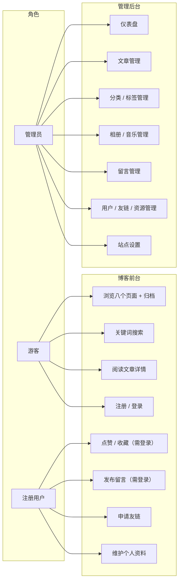

# 简柚个人博客系统 — 需求分析

> 学生：简之航　学号：202420330504　班级：软件技术 2-2405
> 版本：v3.0　日期：2026-09-23
> 配套文档：`数据库设计文档.md`、`功能结构图与流程图.md`、`系统架构设计.md`、`UI设计图/`
> 说明：本文档已按**当前系统实际实现**核对（接口清单、权限、表结构均与代码一致），
> 尚未实现的需求统一在 **第九章「需求实现状态对照」** 中标注，作为后续迭代依据。

---

## 一、引言

### 1.1 编写目的

本文档对"简柚个人博客系统"进行完整的需求分析，明确系统的用户角色、功能需求、非功能需求与界面设计需求，作为概要设计、数据库设计、详细设计与测试验收的依据。预期读者：指导教师、答辩评委、开发者本人。

### 1.2 项目背景

博客定位为**个人成长记录本**——记录学习路程、旅途见闻与日常随感。区别于技术作品集或营销型站点，全站界面措辞采用中性的记录式表达（如"最近写的""按时间翻"），不设推荐位、精选位与营销文案。

系统形态为 B/S 架构、前后端分离的动态博客：博客前台（读者浏览）+ 管理后台（博主维护）+ 服务端（RESTful API）。

### 1.3 术语定义

| 术语 | 定义 |
|---|---|
| 前台 | 面向访客与读者的博客站点（`blog-web` 站点根路由，Tailwind 手写版式） |
| 后台 | 面向博主的管理站点（`blog-web` 内的 `/admin` 路由组 + `AdminLayout.vue`，Element Plus 组件库） |
| 墨色刊头 | 前台每个页面顶部的深墨绿全屏刊头区块，是全站统一视觉节奏 |
| 文字雨 | 留言板的呈现形式：墨绿夜空底 + canvas 整句字幅缓缓飘落，鼠标控制风向 |
| JWT | JSON Web Token，无状态认证令牌；本项目签发 access（载荷含 `userId` 与 `role`）与 refresh（载荷含 `userId` 与 `jti`）两类 |
| MinIO | 自部署的 S3 兼容对象存储，承载图片与音频文件 |
| 接口前缀 | 服务端统一 `context-path: /api`，下文接口均省略该前缀 |

---

## 二、系统总体描述

### 2.1 用户角色

系统设三级角色，权限向下包含：

| 角色 | 标识 | 权限范围 |
|---|---|---|
| 游客 | 未登录 | 浏览全部前台页面（今日、记录、游记、随笔、相册、百宝箱、家、留言、归档、搜索）、文章详情；查看飘落的留言字幅；**留言（无需登录，填昵称即可，昵称缺省「访客」）** |
| 注册用户 | `user.role='USER'` | 游客全部权限 + **点赞、收藏**（二者均需登录）、申请友链、维护个人资料、我的收藏 |
| 管理员 | `user.role='ADMIN'` | 注册用户全部权限 + 后台全部功能（仪表盘、文章 / 分类 / 标签 / 相册 / 音乐 / 留言 / 友链 / 用户 / 资源管理、站点设置） |

**注册登录仅支持手机号或邮箱**（无需验证码），不提供用户名注册，不接第三方 OAuth。管理员不设独立表，用 `user.role` 字段标识。

### 2.2 运行环境

| 项 | 要求 |
|---|---|
| 服务端 | JDK 21、Spring Boot 3.5.x、Docker 容器化部署 |
| 数据存储 | MySQL 8.0、Redis 7.x、MinIO（图片 / 音频对象存储，本地私有部署） |
| 客户端 | Chrome / Edge / Safari / Firefox 现代浏览器，响应式适配移动端 |
| 网络 | 前后台经 Nginx 反向代理统一入口，HTTPS |

### 2.3 设计约束（与实现一致）

- **点赞与收藏以登录账号为维度落库**（`t_like_record` / `t_collect` 联合唯一索引），游客点击时引导登录
- 图片与音频存储使用 **MinIO** 本地私有部署，不依赖云 OSS
- 删除策略为**物理删除**（不使用 `deleted` 逻辑删除字段）
- 关键词搜索基于 `title` / `summary` 模糊匹配；ngram 全文索引为后续优化项（见第九章）
- 前台导航固定 8 项纯文字，无图标、无 emoji
- 统一响应体 `Result<T>`，业务异常统一用 `code` 区分（400 参数 / 401 未登录 / 403 无权限 / 404 不存在）

### 2.4 角色用例图



**游客到注册用户的转化点：点赞按钮、收藏按钮。** 未登录点击时统一跳转登录页（`/login?redirect=<当前路径>`），登录后回到原位置——这两处必须绑定账号才能去重与回显（见 2.3 设计约束）。留言墙不做登录限制：允许游客直接提交，但**仅在前端本页飘一次、不入库**（`MessageView` 未登录分支），登录用户提交才调 `POST /portal/messages` 落库，因此留言墙是"体验型"而非"强制型"转化点。

---

## 三、前台功能需求

导航固定 8 项、纯文字，顺序为：**今日 `/` · 记录 `/category/1` · 游记 `/category/2` · 随笔 `/category/3` · 相册 `/album` · 百宝箱 `/toolbox` · 家 `/about` · 留言 `/message`**。另有归档 `/archive` 与搜索 `/search` 作为导航右侧入口与全局能力，不占导航项。

分类编号约定：**记录=1、游记=2、随笔=3**。游记、随笔、记录是**三个版式完全不同的独立页面**，不共用列表模板、不放分类切换条；其余分类与兜底走通用列表页 `ArticleListView`（分页 + 封面卡片）。

### FR-01 首页

模块概述：杂志式首页，承担"第一眼"与"内容索引"职责，由四个区块自上而下组成。

| 编号 | 功能点 | 具体需求 |
|---|---|---|
| F-01.1 | 杂志刊头 | 全屏深墨绿刊头：反白衬线大标题 + 副行标语 + 刊底统计（篇文章 / 个分类 / 个标签 / 次阅读）+ 横滑文章带（滚轮纵向滚动转为横向滚动，支持按住拖动）；点击卡片跳转文章详情 |
| F-01.2 | 最近写的 | 取列表前 3 篇，目录式三栏排版（大号序号 + 标题 + 摘要 + 元信息） |
| F-01.3 | 按时间翻 | 第 4 篇起渲染纵向时间轴（日期 + 标题 + 分类标签），滚动进入视口时淡入上浮 |
| F-01.4 | 封底 | 满幅墨色收束区块，避免大屏下页面戛然而止 |
| F-01.5 | 无封面题图 | 文章无封面时前端自动生成杂志色渐变题图 + 衬线大字，不出现空白占位 |

数据与接口：`GET /api/portal/articles?page=1&size=12&sort=latest`、`GET /api/portal/categories`、`GET /api/portal/tags`、`GET /api/portal/site/config`（站点名称、副标题、版权等由 Pinia 站点 store 全局持有）。涉及表：`t_article`、`t_category`、`t_tag`、`t_site_config`。

### FR-02 家（/about）

| 编号 | 功能点 | 具体需求 |
|---|---|---|
| F-02.1 | 博主自述 | Markdown 渲染的介绍段落（打招呼、正在做的事），内容取站点设置 `aboutContent` |
| F-02.2 | 统计小卡 | 文章数 / 总字数 / 分类数 / 标签数等指标卡，由文章列表与分类标签接口聚合 |
| F-02.3 | 站点信息 | 站点名称、副标题、作者、简介、社交链接（GitHub）、邮箱、备案号等取站点设置 |

数据与接口：`GET /api/portal/site/config`、`GET /api/portal/articles`、`GET /api/portal/categories`、`GET /api/portal/tags`。涉及表：`t_site_config`（Key-Value）、`t_article`、`t_category`、`t_tag`。

### FR-03 游记（/category/2，封面卡片流）

| 编号 | 功能点 | 具体需求 |
|---|---|---|
| F-03.1 | 封面卡片流 | 两列错落大图卡片：题图 / 渐变题图 + 日期 + 标题 + 摘要 + 字数与估时 |
| F-03.2 | 分页 | 每页固定条数，滚动到底加载更多（无更多时给出结束提示） |

数据与接口：`GET /api/portal/articles?categoryId=2&page=&size=`。涉及表：`t_article`、`t_article_tag`。

### FR-04 随笔（/category/3，杂志目录）

| 编号 | 功能点 | 具体需求 |
|---|---|---|
| F-04.1 | 杂志目录 | 目录式排版：顶部"目录 · CONTENTS"卷标；条目 = 大号描边序号 + 标题 + 摘要 + 右栏（年月、字数、估时、分类标签） |
| F-04.2 | 估时 | 估时取后端 `readMinutes` 字段（正文词数 ÷ 400 字/分钟，向上取整，最小 1 分钟） |
| F-04.3 | 分页 | 底部数字分页器 |

数据与接口：`GET /api/portal/articles?categoryId=3&page=&size=`。涉及表：`t_article`。

### FR-05 记录（/category/1，时间轴）

| 编号 | 功能点 | 具体需求 |
|---|---|---|
| F-05.1 | 垂直时间轴 | 左侧轴线 + 橙色节点；条目 = 日期 + 标题 + 分类标签，条目间虚线分隔 |
| F-05.2 | 分页 | 支持继续加载 |

数据与接口：`GET /api/portal/articles?categoryId=1&page=&size=`。涉及表：`t_article`。

### FR-06 相册（/album，瀑布流）

| 编号 | 功能点 | 具体需求 |
|---|---|---|
| F-06.1 | 瀑布流照片墙 | CSS columns 多列瀑布流，照片高度按 `ratio` 字段预留（避免加载跳动）；`url` 为空时以 `tone` 渐变 + `emoji` 渲染占位图 |
| F-06.2 | 大图弹层 | 点击照片 Teleport 全屏弹层：大图（MinIO 原图）+ 标题 + 拍摄地点 + 拍摄日期；支持左右箭头切换、Esc / 点击遮罩关闭；弹层打开时锁背景滚动 |
| F-06.3 | 排序 | 按后台设置的排序权重升序展示，仅显示状态为"显示"的照片 |

数据与接口：`GET /api/portal/album`。涉及表：`t_photo`（单表扁平结构，不设相册分组表）。

### FR-07 百宝箱（/toolbox）

| 编号 | 功能点 | 具体需求 |
|---|---|---|
| F-07.1 | 工具卡三组 | 三组工具卡片，卡片 = 名称 + 一句话说明 + 外链 |
| F-07.2 | 友链展示 | 友链并入本页底部展示：站点名 + 首字色块图标 + 描述，仅展示已上架（`status=1`）的记录 |
| F-07.3 | 友链申请 | 表单：站点名（≤30 字）、站点地址（≤200 字，前端校验须 `http(s)://` 开头）、Logo 可选（≤300 字）、一句话描述（≤60 字）、联系邮箱（≤50 字）；提交后 `status=0` 待审核（同地址防重复提交**未实现**） |

数据与接口：`GET /api/portal/links`、`POST /api/portal/links/apply`。涉及表：`t_friend_link`。

### FR-08 留言（/message，文字雨）

| 编号 | 功能点 | 具体需求 |
|---|---|---|
| F-08.1 | 墨绿夜空场景 | 全屏 100dvh 不滚动：背景为纯 CSS 渐变 + SVG 绘制的墨绿夜空，与全站刊头同属一个色族，**不引用外部图片**；页面隐藏 Footer 与返回顶部按钮 |
| F-08.2 | 文字雨字幅 | 留言以**整句字幅**的形式在 canvas 画布上缓缓飘落，每条留言是一句完整可读的句子而非截断碎片；每条字幅随机分配横向位置、下落速度与起始延迟，出生淡入、近底部淡出，飘出视野后从另一侧回收 |
| F-08.3 | 鼠标控风 | 鼠标左右移动时，所有字幅的横向偏移按鼠标相对屏幕中心的比例同步变化，并带惯性与微倾，形成"被风推着走"的观感 |
| F-08.4 | 提交留言 | 右侧留言输入区：**无需登录**，任何访客均可提交。内容 ≤300 字（前端输入框 `maxlength=60`）、昵称 ≤20 字（可留空，服务端存为「访客」）、邮箱可选但须格式合法；提交后写入 `t_message` 表（`user_id` 记为 NULL，同时记录 IP 归属地），并以新字幅加入飘落队列 |

数据与接口：`GET /api/portal/messages?page=&size=`、`POST /api/portal/messages`。涉及表：`t_message`。

### FR-09 归档（/archive）

| 编号 | 功能点 | 具体需求 |
|---|---|---|
| F-09.1 | 按年月归档 | 后端按月分组返回（年 + 月 + 当月文章列表），前台按时间倒序展示，点击条目跳文章详情 |

数据与接口：`GET /api/portal/articles/archive`。涉及表：`t_article`。

### FR-10 关键词搜索（全局）

| 编号 | 功能点 | 具体需求 |
|---|---|---|
| F-10.1 | 搜索入口 | 导航右侧"搜一搜…"胶囊，点击进入搜索页 |
| F-10.2 | 搜索执行 | 关键词匹配**标题 + 摘要**（`LIKE` 模糊匹配），按发布时间倒序；结果页复用通用列表版式并高亮关键词；空关键词给出引导态 |
| F-10.3 | 分页与回填 | 结果分页展示；URL 携带关键词，刷新与分享链接可重现结果 |

接口：`GET /api/portal/articles?keyword=&page=&size=`。涉及表：`t_article`。

> 说明：`task`「基于 MySQL 8 ngram 全文索引实现全文检索」为后续优化项，当前以 `LIKE` 实现（无全文索引），详见 9.2。

---

## 四、注册登录与个人中心

### 4.1 注册流程（手机号 / 邮箱，至少填一项）

```
选择注册方式（手机号 / 邮箱，可只填其一）
  → 输入账号 → 前端格式校验（手机号 ^1[3-9]\d{9}$ / 邮箱正则）+ 昵称（2–20 字）+ 密码（6–32 位）
  → 提交注册 → 后端校验：至少提交一项；已存在则拒绝（手机号唯一 / 邮箱唯一）
  → BCrypt 加密密码 → 写入 t_user（role=USER，status=1）
  → 自动登录，返回 JWT + 用户信息
```

**校验规则汇总**

| 校验点 | 规则 | 失败提示 |
|---|---|---|
| 账号必填 | 手机号 / 邮箱**至少一个** | 请填写手机号或邮箱 |
| 账号格式 | 手机号 / 邮箱正则（前端实时校验，后端二次校验） | 手机号格式不正确 |
| 账号唯一 | `uk_phone` / `uk_email` 唯一索引 + 注册前查询 | 该手机号已被注册 / 该邮箱已被注册 |
| 昵称 | 2–20 字，非空 | 请输入昵称 |
| 密码强度 | 6–32 位 | 密码长度需为 6–32 位 |

### 4.2 登录与退出

| 编号 | 功能点 | 具体需求 |
|---|---|---|
| F-L1 | 密码登录 | 输入框自动识别手机号 / 邮箱，后端按 `phone OR email` 匹配账号；BCrypt 比对密码；失败统一提示"手机号/邮箱或密码错误"（不泄露账号是否存在） |
| F-L2 | 账号禁用拦截 | `status = 0` 的账号返回 403"账号已被禁用" |
| F-L3 | 令牌 | 登录 / 注册成功签发**双 Token**：access（默认 2 小时，subject = `userId`，claim = `role`）+ refresh（默认 7 天，带 `jti`、不带角色）。refresh 的 `jti` 登记 Redis（`blog:auth:refresh:{jti}`，TTL 7 天），**删除即撤销**；前端存 `localStorage`（`token` / `refresh_token`）。请求经拦截器解析 **access** 后写入服务端 `AuthContext` |
| F-L4 | 静默续期 | access 过期时前端拦截业务码 401，自动用 refresh 调 `POST /api/auth/refresh` 换发新一对令牌并**重放原请求**，用户无感知；失败则清本地并跳登录页。刷新为**轮换制**（旧 refresh 立即作废），且刷新时**回库读取最新 `role` 与 `status`**，账号被降权或禁用立即生效 |
| F-L5 | 退出 | 调 `POST /api/auth/logout` 撤销服务端 refresh 登记（幂等），再清除本地令牌与用户信息，回到游客态 |
| F-L6 | 登录后跳转 | 支持 `?redirect=` 参数，登录后回到触发登录的原页面（点赞 / 收藏 / 留言场景） |

接口：`POST /api/auth/login`、`POST /api/auth/register`、`POST /api/auth/refresh`、`POST /api/auth/logout`、`GET /api/auth/me`。

> **取舍说明**：不做 access token 黑名单——access 到期前仍有效，靠 2 小时短效期收敛风险；这与「Redis 只承担天然带有效期的数据」原则一致，避免为撤销名单引入额外的存储与清理逻辑。

### 4.3 个人中心

| 编号 | 功能点 | 具体需求 |
|---|---|---|
| F-P1 | 修改头像 | 选择图片（仅图片、≤2MB）→ 上传至 MinIO → 更新 `user.avatar` → 立即刷新头像显示 |
| F-P2 | 修改昵称 / 简介 | 昵称 2–20 字必填；简介 ≤255 字，可为空 |
| F-P3 | 修改密码 | 校验当前密码 → 新密码 6–32 位 → BCrypt 重新加密写入 |
| F-P4 | 我的收藏 | 列出当前用户收藏的文章（按收藏时间倒序分页），点击进入文章详情 |

接口：`PUT /api/auth/profile`、`PUT /api/auth/password`、`POST /api/auth/avatar`、`GET /api/portal/articles/me/collections`。涉及表：`t_user`、`t_collect`、`t_article`。

---

## 五、后台功能需求

后台入口为 `/admin` 路由，仅 `role=ADMIN` 可访问，非管理员拒绝进入。布局：左侧菜单 + 顶部标签栏 + 内容区（Element Plus）。

### BR-01 仪表盘（Dashboard）

| 编号 | 功能点 | 具体需求 |
|---|---|---|
| B-01.1 | 统计卡 | 文章总数（已发布 / 草稿分列）、留言数、友链待审数、用户数、全站总浏览量 |
| B-01.2 | 今日访问 | 今日访问总数 + 按省份分布的统计（数据源 `t_visit_log`） |
| B-01.3 | 分类占比 | 各分类文章数占比（图表） |

接口：`GET /api/admin/dashboard`。涉及表：`t_article`、`t_message`、`t_friend_link`、`t_user`、`t_visit_log`。

### BR-02 文章管理

| 编号 | 功能点 | 具体需求 |
|---|---|---|
| B-02.1 | 文章列表 | 分页；条件查询：标题关键词、分类、状态（草稿 / 已发布 / 隐藏）；置顶优先 + 创建时间倒序；行操作：编辑 / 删除 / 置顶 / 改状态 |
| B-02.2 | 新增 / 编辑 | 标题、分类、标签多选、封面上传（可空→前台渐变题图）、摘要、正文 Markdown 编辑器（实时预览）；字数与估时由后端自动计算 |
| B-02.3 | 状态管理 | 草稿 / 已发布 / 隐藏三态；可发布、可撤回草稿、可置顶 |
| B-02.4 | 删除 | 物理删除，同时级联清理该文章的点赞、收藏记录与标签关联 |
| B-02.5 | 标签关联 | 保存时重建 `t_article_tag` 关联（先清后插） |

接口：`GET /api/admin/articles`、`GET|POST /api/admin/articles/{id}`、`PUT /api/admin/articles/{id}`、`PUT /api/admin/articles/{id}/status`、`PUT /api/admin/articles/{id}/top`、`DELETE /api/admin/articles/{id}`。涉及表：`t_article`、`t_article_tag`、`t_like_record`、`t_collect`。

### BR-03 分类管理

| 编号 | 功能点 | 具体需求 |
|---|---|---|
| B-03.1 | 分类列表 | 展示名称、别名、描述、图标、排序权重 |
| B-03.2 | 新增 / 编辑 | 名称、别名（slug）、描述、图标标识、排序权重 |
| B-03.3 | 删除 | 删除分类；前台对应列表随之不再返回该分类文章 |

涉及表：`t_category`。

### BR-04 标签管理

| 编号 | 功能点 | 具体需求 |
|---|---|---|
| B-04.1 | 标签列表 | 展示名称、别名、展示颜色 |
| B-04.2 | 新增 / 编辑 | 名称、别名、颜色 |
| B-04.3 | 删除 | 删除标签并清理文章标签关联 |

涉及表：`t_tag`、`t_article_tag`。

### BR-05 相册管理

| 编号 | 功能点 | 具体需求 |
|---|---|---|
| B-05.1 | 照片列表 | 列出全部照片（含隐藏），展示标题、图片 / 占位、地点、拍摄日期、排序权重、状态 |
| B-05.2 | 新增 / 编辑 | 标题、图片（上传 MinIO，可留空使用渐变占位）、拍摄地点、拍摄日期、宽高比、占位渐变色与符号、排序权重 |
| B-05.3 | 状态与删除 | 切换显示 / 隐藏；删除照片记录 |

接口：`GET|POST /api/admin/photos`、`PUT /api/admin/photos/{id}`、`PUT /api/admin/photos/{id}/status`、`DELETE /api/admin/photos/{id}`。涉及表：`t_photo`。

### BR-06 音乐管理

| 编号 | 功能点 | 具体需求 |
|---|---|---|
| B-06.1 | 曲目列表 | 展示曲名、作者 / 来源、音频地址、排序权重、状态 |
| B-06.2 | 新增 / 编辑 | 曲名、作者 / 来源、音频地址（外链或 MinIO 直链）、排序权重 |
| B-06.3 | 状态与删除 | 启用 / 停用；删除曲目 |

接口：`GET|POST /api/admin/musics`、`PUT /api/admin/musics/{id}`、`PUT /api/admin/musics/{id}/status`、`DELETE /api/admin/musics/{id}`。涉及表：`t_music`。

### BR-07 留言管理

| 编号 | 功能点 | 具体需求 |
|---|---|---|
| B-07.1 | 留言列表 | 分页展示内容、昵称、IP 属地、时间；支持按 IP 属地模糊筛选 |
| B-07.2 | 删除 | 删除违规留言 |

接口：`GET /api/admin/messages`、`DELETE /api/admin/messages/{id}`。涉及表：`t_message`。

### BR-09 友链管理

| 编号 | 功能点 | 具体需求 |
|---|---|---|
| B-09.1 | 友链列表 | 展示站点名、地址、描述、Logo、状态、排序权重 |
| B-09.2 | 审核操作 | 待审（0）/ 已上架（1）/ 下架（2）三态切换；上架后前台可见 |
| B-09.3 | 增删改 | 新增、编辑、删除友链 |

接口：`GET|POST /api/admin/links`、`PUT /api/admin/links/{id}`、`PUT /api/admin/links/{id}/status`、`DELETE /api/admin/links/{id}`。涉及表：`t_friend_link`。

### BR-10 用户管理

| 编号 | 功能点 | 具体需求 |
|---|---|---|
| B-10.1 | 用户列表 | 分页；支持昵称 / 手机号 / 邮箱关键词搜索；展示注册方式（手机号 / 邮箱）、昵称、角色、状态、注册时间 |
| B-10.2 | 禁用 / 启用 | 禁用后该账号不可登录（登录校验 `status`）；启用恢复 |
| B-10.3 | 删除约束 | **不提供用户删除**，仅禁用——保留互动记录完整性 |

接口：`GET /api/admin/users`、`PUT /api/admin/users/{id}/status`。涉及表：`t_user`。

### BR-11 资源管理

| 编号 | 功能点 | 具体需求 |
|---|---|---|
| B-11.1 | 资源列表 | 分页展示上传到 MinIO 的文件：文件名、访问地址、MIME 类型、大小、上传时间 |
| B-11.2 | 上传 | 支持图片与音频上传并写入 `t_file` 记录 |
| B-11.3 | 删除 | 删除记录同时移除 MinIO 对象 |

接口：`GET /api/admin/files`、`DELETE /api/admin/files/{id}`、`POST /api/admin/uploads`。涉及表：`t_file`。

### BR-12 站点设置

| 编号 | 功能点 | 具体需求 |
|---|---|---|
| B-12.1 | 站点信息 | 站点名称、副标题、Logo、描述、关键词、作者、作者简介、版权、备案号、社交链接、邮箱、家页自述等 |
| B-12.2 | 存储策略 | 写入 `t_site_config`（键值对）；数据库值覆盖 `application.yml` 中 `site.*` 默认值，无记录的键回落默认值 |

接口：`GET|PUT /api/admin/site/config`。涉及表：`t_site_config`。

---

## 六、非功能需求

| 类别 | 编号 | 需求 |
|---|---|---|
| 性能 | NF-1 | 列表接口 P95 < 500ms；首屏 LCP < 2.5s |
| 性能 | NF-2 | 热点查询（首页聚合、列表分页）全部走索引，不引入查询缓存中间层，保证数据变更后立即可见 |
| 性能 | NF-3 | 列表与详情接口均使用索引支撑，无全表扫描（联合索引见数据库设计文档第五章） |
| 安全 | NF-4 | JWT 无状态认证 + 三级权限控制；后台接口校验 `role=ADMIN` |
| 安全 | NF-5 | 密码 BCrypt 加密存储，登录失败不区分"账号不存在"与"密码错误" |
| 安全 | NF-6 | XSS：Markdown 渲染白名单过滤；SQL 注入：MyBatis-Plus 参数绑定，不使用字符串拼接 |
| 安全 | NF-7 | 隐私：留言只存**脱敏后的 IP 属地**，不落原始 IP |
| 安全 | NF-8 | 上传文件按用途限制类型与大小（图片 ≤5MB、头像 ≤2MB、音频 ≤1028MB） |
| 兼容 | NF-9 | 响应式适配 375px–1920px；明暗双主题（默认浅色） |
| 可维护 | NF-10 | 前后台共享 `tokens.css` 设计令牌层；统一响应体 `Result<T>`；全局异常处理 |
| 可部署 | NF-11 | Docker Compose 一键编排；Jenkins 流水线自动化构建发布 |
| 可观测 | NF-12 | Prometheus + Grafana 指标监控，Loki 日志聚合 |

---

## 七、界面设计需求（视觉规范摘要）

前台采用**杂志式视觉语言**，全站统一"墨色刊头 + 暖纸正文"节奏，每一个页面开头都是墨色刊头：

| 要素 | 规范 |
|---|---|
| 墨色刊头 | 深墨绿 `#101714` 全屏区块（`--ink-*` 变量组），反白衬线大字 |
| 暖纸正文 | 底色 `#faf9f7`，主色柚橙 `#d95d18`，辅色墨绿 `#2f5d50` |
| 字体 | 展示字体 `--font-display`（Noto Serif SC 衬线栈）用于标题 / 序号 / 月份；正文无衬线 |
| 默认主题 | 浅色（暖纸白），暗色仅手动切换 |
| 措辞 | 中性记录式表达，禁用推荐 / 精选 / 营销类文案 |
| 留言 | 墨绿夜空 + canvas 整句字幅文字雨 + 右侧留言输入区，鼠标控风向，100dvh 不滚动 |

逐页高保真图稿见 `docs/02-设计文档/UI设计图/`。

---

## 八、数据需求概述

数据库 `jianyou_blog`（`utf8mb4`），共 **14 张表**（物理表名统一 `t_` 前缀）：

| 分类 | 表 |
|---|---|
| 用户与权限 | `t_user` |
| 内容 | `t_article`、`t_category`、`t_tag`、`t_article_tag` |
| 互动 | `t_like_record`、`t_collect`、`t_message` |
| 站点运营 | `t_friend_link`、`t_site_config`、`t_photo`、`t_music` |
| 文件与统计 | `t_file`、`t_visit_log` |

另有 3 张**预留扩展表**（`t_sensitive_word`、`t_operation_log`、`t_article_history`）已完成结构设计但本期未建表，详见数据库设计文档 3.15 与本文 9.2。

核心关系：用户 1—N 文章 / 留言 / 点赞 / 收藏；文章 N—1 分类、N—N 标签；点赞与收藏均为用户对文章的 1—N 关系（分别以 `t_like_record`、`t_collect` 联合唯一索引约束）；照片与音乐为独立的展示型数据表。

---

## 九、需求实现状态对照

### 9.1 已实现（可直接演示与截图）

| 模块 | 实现要点 |
|---|---|
| 注册 / 登录 | 手机号 / 邮箱至少一项 + 昵称 + 密码；BCrypt；双 Token（access 2h + refresh 7d 轮换）；账号禁用拦截 |
| 个人中心 | 头像上传、昵称 / 简介修改、密码修改、我的收藏 |
| 前台 8 页 + 归档 + 搜索 | 首页、家、游记、随笔、记录、相册、百宝箱、留言；归档按月分组；搜索按标题 / 摘要模糊匹配 |
| 文章详情 | Markdown 渲染 + 目录锚点、点赞、收藏 |
| 留言板 | 文字雨渲染、登录用户留言落库、游客本地飘一次、后台按 IP 属地筛选与删除 |
| 相册 / 音乐 | 照片瀑布流与大图弹层；全站 BGM 歌单播放 |
| 友链 | 前台百宝箱页提交申请（落库 `status=0` 待审）、后台审核上架、前台展示；防重复申请未实现 |
| 后台 11 模块 | 仪表盘、文章、分类、标签、相册、音乐、留言、友链、用户、资源、站点设置 |
| 文件存储 | MinIO 上传（图片 / 头像 / 音频，按用途区分类型与大小限制），`t_file` 留痕 |
| 访问统计 | 页面访问埋点 + IP 属地脱敏解析 + 仪表盘今日访问与省份分布 |

### 9.2 待实现（任务书已要求或设计已定义，本期未落地）

| 项 | 现状 | 后续方案 |
|---|---|---|
| ngram 全文索引检索 | 现为 `title` / `summary` 的 `LIKE` 匹配 | 对 `t_article(title, summary, content)` 加 `FULLTEXT ... WITH PARSER ngram`，改用 `MATCH … AGAINST` 按相关度排序 |
| 浏览量 Redis 缓冲 + 定时落库 | 现为按独立访客去重（`t_view_record` 唯一索引）后直接 `UPDATE view_count + 1` | 改为 Redis Hash 累加 + Spring Task 定时批量落库；热门排行功能已整体移除（含前端接口与后端缓存代码），ZSet 榜不在本期范围 |
| 敏感词过滤 | 未实现（预留表 `t_sensitive_word`） | 词库加载进内存构建 Trie 字典树，留言提交时匹配，命中按等级替换或拒绝 |
| 文章版本历史与回滚 | 未实现（预留表 `t_article_history`） | 每次保存写全量快照，版本号在应用层递增，支持版本列表与一键回滚 |
| 操作日志 | 未实现（预留表 `t_operation_log`） | AOP 切面记录后台关键操作（操作人、动作、URI、IP、耗时、结果） |
| 验证码注册 / 登录 | 找回密码已实现（注册 / 登录仍未接） | 验证码存 Redis 并设 TTL、冷却与失败计数，通道层为可替换接口（当前占位实现）。注册仍为纯密码，未接真实短信 / SMTP 通道 |
| 定时发布 | 未实现（现为草稿 / 发布 / 隐藏手动切换） | 增加"定时"状态 + Spring Task 每分钟扫描 `publish_time <= NOW()` 自动发布 |
| 接口限流 | 未实现 | `@RateLimit` + Redis 滑动窗口，覆盖登录、注册、发留言、搜索等入口 |
| 相册分组 | 未实现（单表 `t_photo`） | 增加相册分组表，照片附 `album_id`，前台增加分组筛选条 |
| 用户重置密码 | 用户端已实现，管理员端未实现 | 用户端：登录页「忘记密码」自助找回（手机号 / 邮箱 + 验证码 + 新密码），找回方式跟随注册时留下的联系方式。管理员端：代重置为一次性临时密码、首次登录强制修改，仍未实现 |
| 数据看板图表 | 未实现（现为统计卡 + 列表） | 引入 ECharts 绘制近 30 天访问趋势折线图与文章分类占比饼图 |
| 博主回复留言 | 未实现（**本期主动移除**：`t_message` 的 `reply` / `reply_time` 两列与 `PUT /admin/messages/{id}/reply` 接口一并删除） | 留言板定位为「一次性留言」，不做对话式追问；若需恢复，回滚列结构并新增后台回复接口与前台回显即可 |

> 同一份差异清单（含每项的取舍理由）见 `docs/01-选题与方案/选题方案与技术方案.md` 第 5.6 节，两份文档保持一致（**均为 12 项**）。
>
> **2026-10-07 移出清单**：「双 Token 与退出黑名单」原列于此，现已实现（access 2h + refresh 7d 轮换、
> Redis 撤销登记、`/auth/refresh` 与 `/auth/logout`），故从待实现清单移出，详见 4.2 节 F-L3~F-L5。
> 其中 access token 黑名单未做（靠短效期收敛），作为取舍保留说明，不再单列为待实现项。

---

*文档结束*
